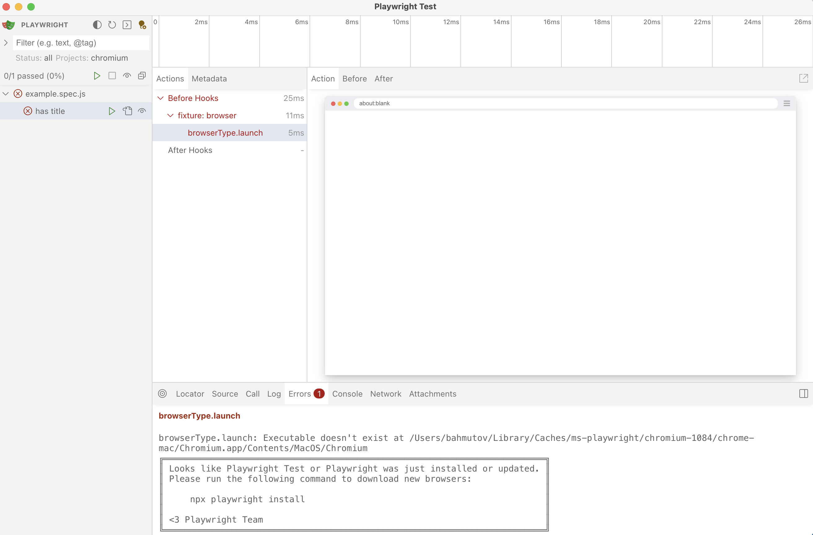
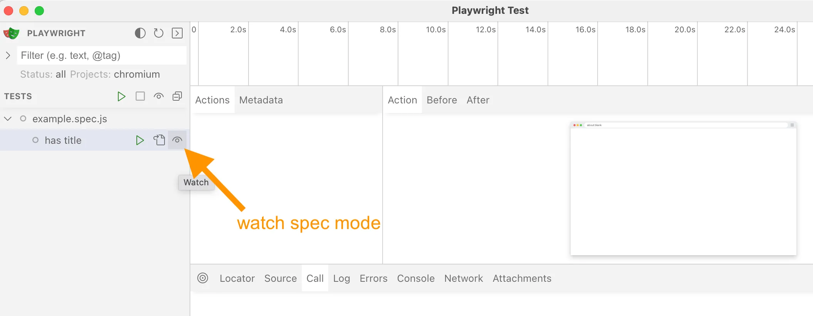
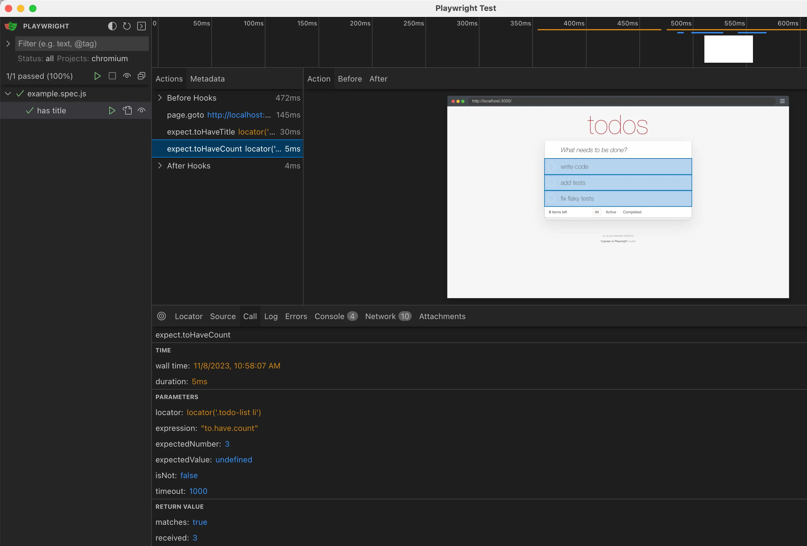

## The very basic tests

### 📚 You will learn

- start the application automatically
- ...
- ...

---

- clean up the existing code
  - `git reset --hard`
  - `git clean -d -f`
- `git checkout a4`
- `npm install`

+++

If necessary, run `npx playwright install` to install browsers



+++

### `package.json`

```json
{
  "scripts": {
    "start": "json-server ...",
    "reset": "node reset-db.js",
    "test:pw": "playwright test",
    "test:cy": "cypress run"
  },
  "dependencies": {
    "json-server": "0.17.4",
    "json-server-reset": "1.6.0"
  },
  "devDependencies": {
    "cypress": "^13.4.0",
    "@playwright/test": "^1.39.0"
  }
}
```

+++

## Todo: start the server from Playwright

- modify the `playwright.config.js` to start the server on port 3000
- verify the application starts when you run Pw tests

💡 Find docs for [Playwright Web Server](https://playwright.dev/docs/test-webserver)

+++

## Solution

```js
const { defineConfig, devices } = require('@playwright/test')

module.exports = defineConfig({
  ...,
  /* Run your local dev server before starting the tests */
  webServer: {
    command: 'npm run start',
    url: 'http://127.0.0.1:3000',
    reuseExistingServer: !process.env.CI,
    // if you want to see the output from the started web server
    // stdout: 'pipe',
  },
})
```

---

## Todo: start the server for Cypress

Use [bahmutov/start-server-and-test](https://github.com/bahmutov/start-server-and-test) plugin

+++

- `$ npm i -D start-server-and-test`

```json
{
  "scripts": {
    "start": "json-server ...",
    "test:pw": "playwright test",
    "test:cy": "cypress run",
    "e2e": "start-test start 3000 test:cy"
  }
}
```

and execute `npm run e2e`

---

## Interactive mode

While working locally, we want to re-run the tests when we save the spec file

- `cypress open` = `playwright test --ui`
- `cypress run` = `playwright test`

📚 [Playwright UI mode docs](https://playwright.dev/docs/test-ui-mode) and [cypress open](https://on.cypress.io/cypress-open)

---

## Working with Playwright test

- reset the code
- `git checkout a5`
- launch Pw interactive mode
- watch the spec file `example.spec.js`

+++

## Watching the spec file



+++

## Finish the test

```js
// pw/example.spec.js

const { test, expect } = require('@playwright/test')

test('has title', async ({ page }) => {
  await page.goto('http://localhost:3000/')

  // Expect a title "to contain" a substring.
  await expect(page).toHaveTitle('cy-vs-pw-example-todomvc')

  // confirm there are 3 todo items on the page
  // use the CSS selector ".todo-list li"
  // https://playwright.dev/docs/locators
  // and the count assertion
  // https://playwright.dev/docs/api/class-locatorassertions
})
```

💡 Read [Page locators](https://playwright.dev/docs/locators) and [Playwright assertions](https://playwright.dev/docs/api/class-locatorassertions)

+++



+++

## Pw Solution

```js
// confirm there are 3 todo items on the page
// use the CSS selector ".todo-list li"
// https://playwright.dev/docs/locators
// and the count assertion
// https://playwright.dev/docs/api/class-locatorassertions
await expect(page.locator('.todo-list li')).toHaveCount(3, {
  timeout: 1000
})
```

+++

## Q: How do you:

- run just the spec `cypress/integration/01-basic/spec.js` in headless mode?

**💡 Hint:** `npx cypress run --help`

+++

## Bonus

**Todo:** use `cypress run` with a failing test.

- video recording [https://on.cypress.io/configuration#Videos](https://on.cypress.io/configuration#Videos)
- `cy.screenshot` command

---

## Fix the test

- can you fix the test?
- how would you select an element: <!-- .element: class="fragment" -->
  - by text
  - by id
  - by class
  - by attributes

**Tip:** https://on.cypress.io/best-practices#Selecting-Elements <!-- .element: class="fragment" -->

**📝 Read:** https://glebbahmutov.com/blog/debug-cy-get-and-contains/ <!-- .element: class="fragment" -->

---

## 🏁 Conclusions

- most commands retry
- run Cypress in headless mode on CI with `cypress run`
- screenshots and videos

➡️ Pick the [next section](https://github.com/bahmutov/cypress-workshop-basics#contents) or jump to the [02-adding-items](?p=02-adding-items) chapter
