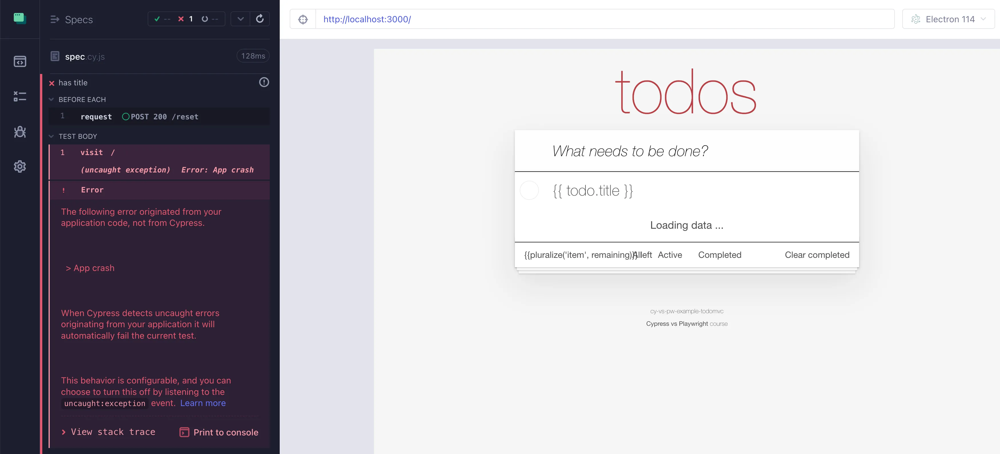

## Adding items tests

### 📚 You will learn

- failing tests on app error
- testing adding items

---

- clean up the existing code
  - `git reset --hard`
  - `git clean -d -f`
- `git checkout a7`
- `npm install`

---

## App crashes on purpose

```js
// app.js

throw new Error('App crash')

// Once the above error causes your test to fail
// can you verify if the test runner catches errors
// throws asynchronously or rejected promises?

// setTimeout(() => {
//   throw new Error('Async app crash')
// }, 10)
//
// Promise.reject(new Error('rejected promise'))
```

---

## Fail Cypress test on app error

```js
// cypress/e2e/spec.cy.js

// commands operate with respect to the "baseUrl"
// defined in the cypress.config.js file

beforeEach(() => {
  cy.request('POST', '/reset', { todos: [] })
})

it('has title', () => {
  console.log('running test "%s"', Cypress.currentTest.titlePath.join('/'))
  cy.visit('/')
  cy.get('body.loaded')
  cy.get('.todo-list li').should('have.length', 0)
})
```

Can you fail the test on all 3 types of app errors?

+++



Cypress should automatically fail the test on any thrown error.

+++

## Bonus question: how to ignore app errors in Cypress?

See https://glebbahmutov.com/blog/sanity-test/#tests

---

## Fail Playwright test on app error

```js
// pw/example.spec.js

const { test, expect } = require('@playwright/test')

// commands operate with respect to the "baseUrl"
// defined in the playwright.config.js file

test.beforeEach(async ({ request }) => {
  await request.post('/reset', { data: { todos: [] } })
})

test('has title', async ({ page }, testInfo) => {
  console.log('running test "%s"', testInfo.titlePath.join('/'))

  // if the application throws an unhandled error
  // we want to fail the test. Make sure to register
  // the error callback before visiting the page

  await page.goto('/')
  await expect(page.locator('body')).toHaveClass('loaded')
  await expect(page.locator('.todo-list li')).toHaveCount(0)
})
```

+++

Playwright v1.40 fixed the async errors

```js
// if the application throws an unhandled error
// we want to fail the test. Make sure to register
// the error callback before visiting the page
page.on('pageerror', (exception) => {
  throw new Error('App threw an error')
})
```

You still need to register the event listener

---

## Test adding an item

- clean up the existing code
  - `git reset --hard`
  - `git clean -d -f`
- `git checkout b1`
- `npm install`

+++

## Playwright test

```js
// pw/example.spec.js

const { test, expect } = require('@playwright/test')

// start each test with zero todos
test.beforeEach(async ({ request }) => {
  await request.post('/reset', { data: { todos: [] } })
})

// Tip: read the "Actions" Guide before implementing this test
// https://playwright.dev/docs/input
// and the "Locators" guide
// https://playwright.dev/docs/locators
test('adding todos', async ({ page }) => {
  // visit the application
  // wait for the body.loaded element to be visible
  // there should be zero todo items
  // find the input element using the placeholder text
  // and type "Write code" followed by "Enter" press
  // there should be one todo item on the page
  // the todo item label should have the entered text
})
```

Locating elements https://playwright.dev/docs/locators

+++

```js
test('adding todos', async ({ page }) => {
  // visit the application
  await page.goto('/')
  await expect(page.locator('body.loaded')).toBeVisible()
  await expect(page.locator('.todo-list li')).toHaveCount(0)
  await page.getByPlaceholder('What needs to be done?').fill('Write code')
  await page.getByPlaceholder('What needs to be done?').press('Enter')
  await expect(page.locator('.todo-list li')).toHaveCount(1)
  await expect(page.locator('.todo-list li label')).toHaveText('Write code')
})
```

---

## Cypress test

```js
// cypress/e2e/spec.cy.js

// start each test with zero todos
beforeEach(() => {
  cy.request('POST', '/reset', { todos: [] })
})

// Tip: look at the following commands before writing this test
// https://on.cypress.io/visit
// https://on.cypress.io/get
// https://on.cypress.io/type
// https://glebbahmutov.com/cypress-examples/commands/assertions.html
it('adding todos', () => {
  // visit the application
  // wait for the body.loaded element to be visible
  // there should be zero todo items
  // find the input element using the placeholder text
  // and type "Write code" followed by "Enter" press
  // there should be one todo item on the page
  // the todo item label should have the entered text
})
```

Selecting elements: https://on.cypress.io/best-practices#Selecting-Elements

+++

```js
it('adding todos', () => {
  cy.visit('/')
  cy.get('body.loaded').should('be.visible')
  cy.get('.todo-list li').should('have.length', 0)
  cy.get('[placeholder="What needs to be done?"]').type('Write code{enter}')
  cy.get('.todo-list li label')
    .should('have.length', 1)
    .and('have.text', 'Write code')
})
```

---

## Refactor the tests

Let's remove code duplication

- clean up the existing code
  - `git reset --hard`
  - `git clean -d -f`
- `git checkout b2`
- `npm install`

+++

## Reuse Playwright locators

```js
test('adding todos', async ({ page }) => {
  // avoid duplicator code by reusing the same locator objects
  await page.goto('/')
  await expect(page.locator('body.loaded')).toBeVisible()
  await expect(page.locator('.todo-list li')).toHaveCount(0)
  await page.getByPlaceholder('What needs to be done?').fill('Write code')
  await page.getByPlaceholder('What needs to be done?').press('Enter')
  await expect(page.locator('.todo-list li')).toHaveCount(1)
  await expect(page.locator('.todo-list li label')).toHaveText('Write code')
})
```

+++

```js
test('adding todos', async ({ page }) => {
  // avoid duplicator code by reusing the same locator objects
  const input = page.getByPlaceholder('What needs to be done?')
  const todos = page.locator('.todo-list li label')

  await page.goto('/')
  await page.locator('body.loaded').waitFor()
  await expect(todos).toHaveCount(0)
  await input.fill('Write code')
  await input.press('Enter')
  await expect(todos).toHaveText(['Write code'])
})
```

Playwright solution

---

## Remove Cypress code duplication

```js
it('adding todos', () => {
  // reuse the same CSS selectors
  cy.visit('/')
  cy.get('body.loaded').should('be.visible')
  cy.get('.todo-list li').should('have.length', 0)
  cy.get('[placeholder="What needs to be done?"]').type('Write code{enter}')
  cy.get('.todo-list li label')
    .should('have.length', 1)
    .and('have.text', 'Write code')
})
```

+++

```js
it('adding todos', () => {
  // reuse the same CSS selectors
  const input = '[placeholder="What needs to be done?"]'
  const todos = '.todo-list li label'

  cy.visit('/')
  cy.get('body.loaded').should('be.visible')
  cy.get(todos).should('not.exist')
  cy.get(input).type('Write code{enter}')
  cy.get(todos).should('have.length', 1).and('have.text', 'Write code')
})
```

Cypress solution

---

## 🏁 Adding

- make your tests fail on the unexpected app errors
- select elements using best practices
- simplify the code

➡️ Pick the [next section](https://github.com/bahmutov/cypress-workshop-cy-vs-pw#contents) or jump to the [03-completing-items](?p=03-completing-items) chapter
