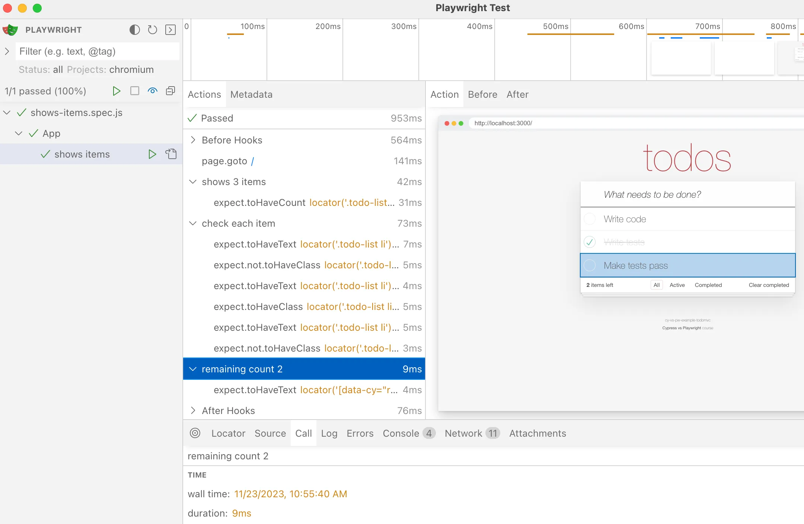
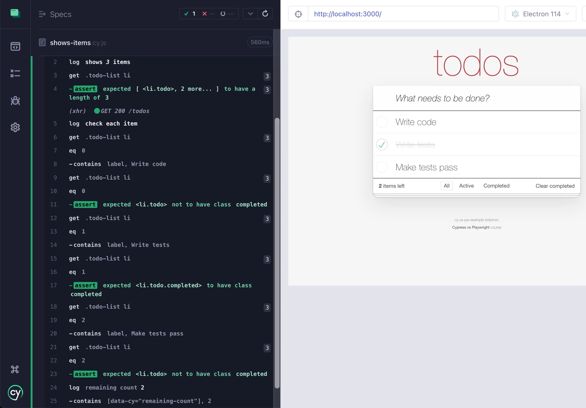

## Test UI

### 📚 You will learn

- test the user interface using fixture data
- better separate test steps

---

- clean up the existing code
  - `git reset --hard`
  - `git clean -d -f`
- `git checkout b5`
- `npm install`

---

## JSON fixture

```json
[
  {
    "title": "Write code",
    "completed": false,
    "id": "1"
  },
  {
    "title": "Write tests",
    "completed": true,
    "id": "2"
  },
  {
    "title": "Make tests pass",
    "completed": false,
    "id": "3"
  }
]
```

Fixture items in `fixtures/three.json`

---

## Playwright

If we reset the backend data using the fixture items

```js
const items = require('../fixtures/three.json')

test.beforeEach(async ({ request }) => {
  await request.post('/reset', { data: { todos: items } })
})
```

+++

Then we can check if the user interface shows the data correctly

```js
// pw/shows-items.spec.js
const items = require('../fixtures/three.json')

test('shows items', async ({ page }) => {
  // common locators
  const todos = page.locator('.todo-list li')
  const count = page.locator('[data-cy="remaining-count"]')

  await page.goto('/')

  // shows N items

  // go through the items and confirm each is rendered correctly
  // - label text
  // - completed or not

  // confirm the remaining items count is correct
})
```

+++

```js
const items = require('../fixtures/three.json')

test('shows items', async ({ page }) => {
  // common locators
  const todos = page.locator('.todo-list li')
  const count = page.locator('[data-cy="remaining-count"]')

  await page.goto('/')

  // shows N items
  await expect(todos).toHaveCount(items.length)
  // go through the items and confirm each is rendered correctly
  // - label text
  // - completed or not
  for (const [k, item] of items.entries()) {
    const itemLocator = todos.nth(k)
    await expect(itemLocator.locator('label')).toHaveText(item.title)
    if (item.completed) {
      await expect(itemLocator).toHaveClass(/completed/)
    } else {
      await expect(itemLocator).not.toHaveClass(/completed/)
    }
  }

  // confirm the remaining items count is correct
  const n = items.filter((item) => !item.completed).length
  await expect(count).toHaveText(String(n))
})
```

Playwright solution. **Note:** `for (... of items.entries)` loop around the `await ...` test commands.

---

## Cypress

Reset the data using the fixture array

```js
// cypress/e2e/shows-items.cy.js

import items from '../../fixtures/three.json'

beforeEach(() => {
  // confirm there are several items
  // and some are completed and some are not

  cy.request('POST', '/reset', { todos: items })
})
```

+++

Confirm the data is rendered correctly

```js
import items from '../../fixtures/three.json'

it('completes a todo', () => {
  // common locators
  const todos = '.todo-list li'
  const count = '[data-cy="remaining-count"]'

  cy.visit('/')

  // shows N items

  // go through the items and confirm each is rendered correctly
  // - label text
  // - completed or not

  // confirm the remaining items count is correct
})
```

+++

```js
it('completes a todo', () => {
  // common locators
  const todos = '.todo-list li'
  const todoLabels = todos + ' label'
  const count = '[data-cy="remaining-count"]'

  cy.visit('/')

  // shows N items
  cy.get(todos).should('have.length', items.length)

  // go through the items and confirm each is rendered correctly
  // - label text
  // - completed or not
  items.forEach((item, k) => {
    cy.get(todos).eq(k).contains('label', item.title)
    if (item.completed) {
      cy.get(todos).eq(k).should('have.class', 'completed')
    } else {
      cy.get(todos).eq(k).should('not.have.class', 'completed')
    }
  })

  // confirm the remaining items count is correct
  const n = items.filter((item) => !item.completed).length
  cy.contains(count, n)
})
```

**Note:** Cypress queues up its commands before executing them, thus we can use simple `Array.forEach` method.

---

## Better test steps UI

- `git checkout b6`

Let's improve how the test runner shows parts of a longer test

```js
// shows the expected number of items
...
// check each item
...
// shows the remaining count
```

---

## Playwright test steps

```js
// pw/shows-items.spec.js

test('shows items', async ({ page }) => {
  // common locators
  const todos = page.locator('.todo-list li')
  const count = page.locator('[data-cy="remaining-count"]')

  await page.goto('/')

  // shows the expected number of items
  await expect(todos).toHaveCount(items.length)

  // check each item
  for (const [k, item] of items.entries()) {
    const itemLocator = todos.nth(k)
    await expect(itemLocator.locator('label')).toHaveText(item.title)
    if (item.completed) {
      await expect(itemLocator).toHaveClass(/completed/)
    } else {
      await expect(itemLocator).not.toHaveClass(/completed/)
    }
  }

  // shows the remaining count
  const n = items.filter((item) => !item.completed).length
  await expect(count).toHaveText(String(n))
})
```

Replace test code comments with `test.step` commands, see https://playwright.dev/docs/api/class-test#test-step

+++

```js
test('shows items', async ({ page }) => {
  // common locators
  const todos = page.locator('.todo-list li')
  const count = page.locator('[data-cy="remaining-count"]')

  await page.goto('/')

  await test.step(`shows ${items.length} items`, async () => {
    await expect(todos).toHaveCount(items.length)
  })

  await test.step('check each item', async () => {
    for (const [k, item] of items.entries()) {
      const itemLocator = todos.nth(k)
      await expect(itemLocator.locator('label')).toHaveText(item.title)
      if (item.completed) {
        await expect(itemLocator).toHaveClass(/completed/)
      } else {
        await expect(itemLocator).not.toHaveClass(/completed/)
      }
    }
  })

  const n = items.filter((item) => !item.completed).length
  await test.step(`remaining count ${n}`, async () => {
    await expect(count).toHaveText(String(n))
  })
})
```

+++

## Playwright nested steps

```js
await test.step(`shows ${items.length} items`, async () => {
  await expect(todos).toHaveCount(items.length)
})
```

+++



---

## Cypress log command

```js
// cypress/e2e/shows-items.cy.js

it('completes a todo', () => {
  // common locators
  const todos = '.todo-list li'
  const count = '[data-cy="remaining-count"]'

  cy.visit('/')

  // shows the expected number of items
  cy.get(todos).should('have.length', items.length)

  // check each item
  items.forEach((item, k) => {
    cy.get(todos).eq(k).contains('label', item.title)
    if (item.completed) {
      cy.get(todos).eq(k).should('have.class', 'completed')
    } else {
      cy.get(todos).eq(k).should('not.have.class', 'completed')
    }
  })

  // shows the remaining count
  const n = items.filter((item) => !item.completed).length
  cy.contains(count, n)
})
```

Replace test code comments with bold log messages using the `cy.log` command https://on.cypress.io/log

+++

```js
it('completes a todo', () => {
  // common locators
  const todos = '.todo-list li'
  const count = '[data-cy="remaining-count"]'

  cy.visit('/')

  cy.log(`**shows _${items.length}_ items**`)
  cy.get(todos).should('have.length', items.length)

  cy.log('**check each item**')
  items.forEach((item, k) => {
    cy.get(todos).eq(k).contains('label', item.title)
    if (item.completed) {
      cy.get(todos).eq(k).should('have.class', 'completed')
    } else {
      cy.get(todos).eq(k).should('not.have.class', 'completed')
    }
  })

  const n = items.filter((item) => !item.completed).length
  cy.log(`remaining count **${n}**`)
  cy.contains(count, n)
})
```

+++

You can use simple Markdown when using `cy.log`

```js
cy.log(`**shows _${items.length}_ items**`)
cy.get(todos).should('have.length', items.length)
```

+++



---

## Testing the UI

- If you control the application data, checking how it is displayed is relatively easy
- Playwright has good wait to indent test steps
- Cypress can format its Command Log messages
  - it can also indent commands, but only inside custom commands

➡️ Pick the [next section](https://github.com/bahmutov/cypress-workshop-basics#contents) or jump to the [05-network](?p=05-network) chapter
