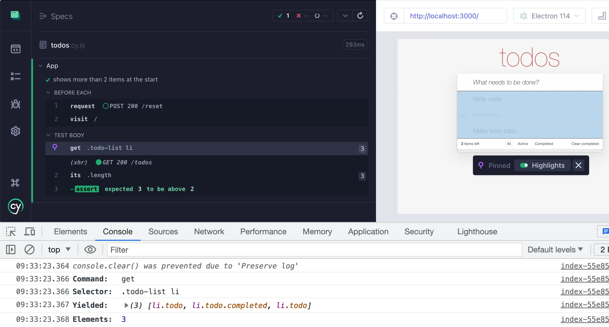
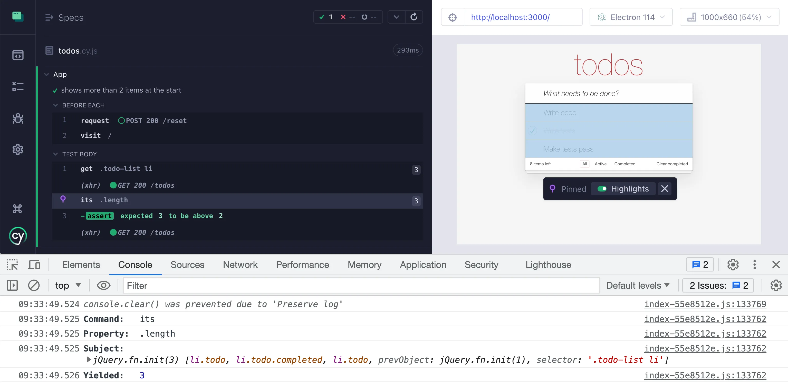
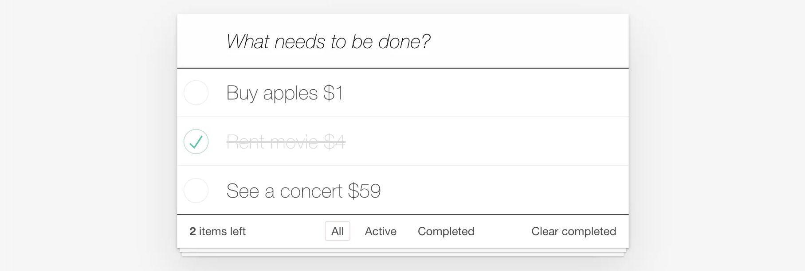
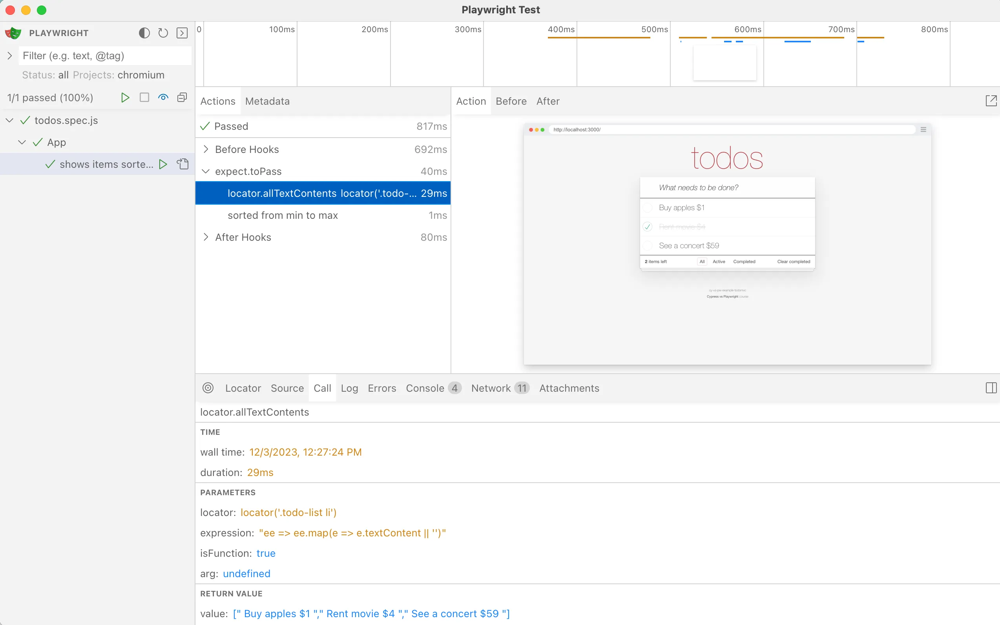
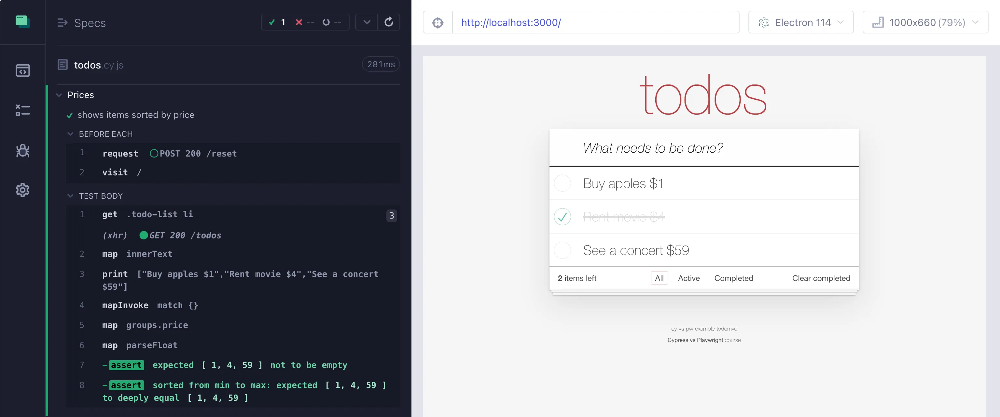
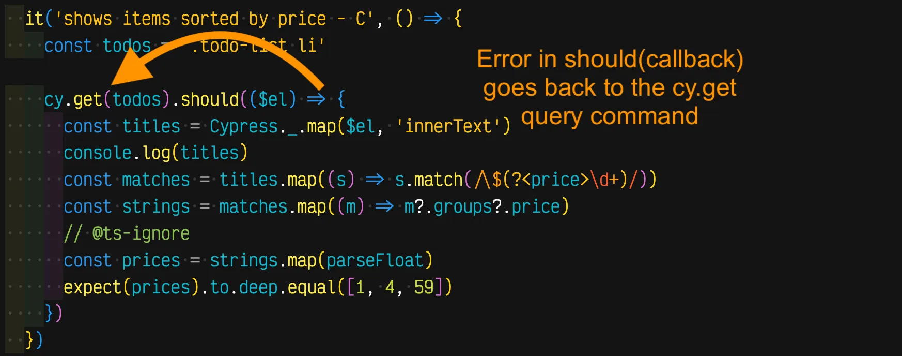
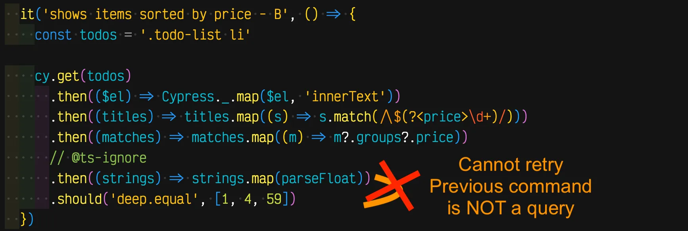
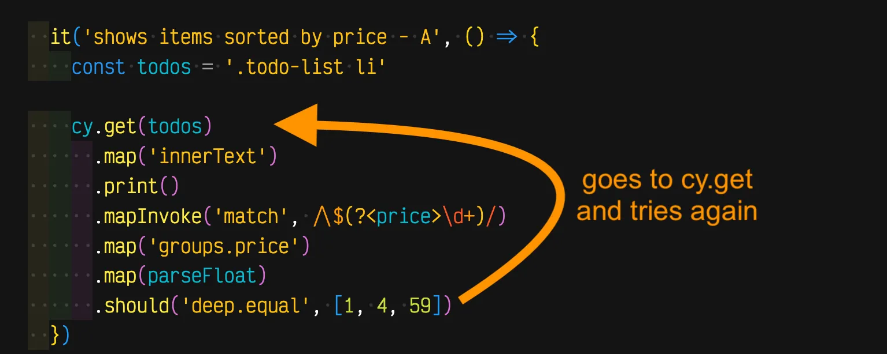
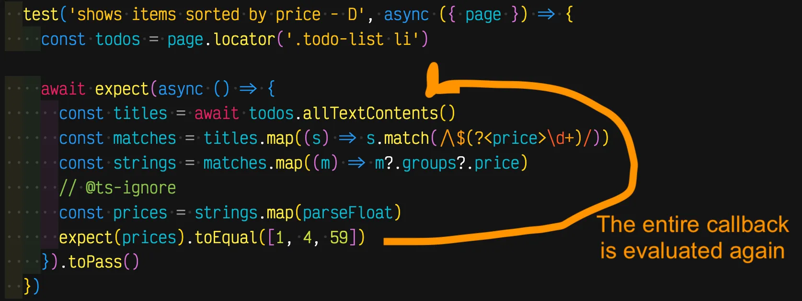
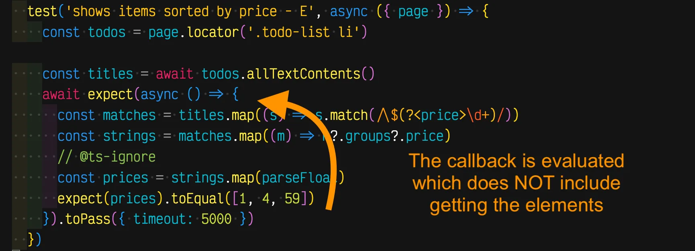

## Assertions and retries

### 📚 You will learn

- how assertions force commands to retry
- writing command chains

+++

**Question:** how would you check if there are more than 2 elements on the page?

+++

```js
cy.get(todos).should('have.length.greaterThan', 2)
```

Cypress assertion

+++

What if you cannot use `have.length.greaterThan`?

```js
cy.get(todos).should(($el) => {
  expect($el.length, 'more than 2 elements').to.be.greaterThan(2)
})
```

+++

```js
cy.get(todos).should(($el) => {
  // synchronous logic inside should(callback)
})
```

Cypress `should(callback)` assertion function

+++

Playwright does not have `have.length.greaterThan` so we can run a "retry" callback

```js
const todos = page.locator('.todo-list li')

await expect(async () => {
  const count = await todos.count()
  expect(count).toBeGreaterThan(2)
}).toPass()
```

---

## Cypress chain

```js
// rewrite the following assertion using a chain of commands
// - get the elements, which in Cypress yields a jQuery object (1)
// - get the property `length` from that jQuery object (2)
// - confirm the number is greater than 2 (3)
// - if the assertion (3) fails, go back to (1)
cy.get(todos).should(($el) => {
  expect($el.length, 'more than 2 elements').to.be.greaterThan(2)
})
```

+++

```js
// rewrite the following assertion using a chain of commands
// - get the elements, which in Cypress yields a jQuery object (1)
// - get the property `length` from that jQuery object (2)
// - confirm the number is greater than 2 (3)
// - if the assertion (3) fails, go back to (1)
cy.get(todos).its('length').should('be.greaterThan', 2)
```

Each step can be debugged!

+++



+++



---

## Confirm sorted prices



How can you confirm the prices are sorted?

+++

From each Todo item you need:

- grab its text
- use a regular expression to find the $<price> match
- convert the string to a number
- confirm the list of numbers is sorted

+++

## Playwright solution

```js
const todos = page.locator('.todo-list li')
await expect(async () => {
  const titles = await todos.allTextContents()
  const matches = titles.map((s) => s.match(/\$(?<price>\d+)/))
  const strings = matches.map((m) => m?.groups?.price)
  // @ts-ignore
  const prices = strings.map(parseFloat)
  const sorted = structuredClone(prices).sort()
  expect(sorted, 'sorted from min to max').toEqual(prices)
}).toPass()
```

+++



+++

## Cypress solution

```js
cy.get(todos).should(($el) => {
  const titles = Cypress._.map($el, 'innerText')
  const matches = titles.map((s) => s.match(/\$(?<price>\d+)/))
  const strings = matches.map((m) => m?.groups?.price)
  const prices = strings.map(parseFloat)
  const sorted = Cypress._.sortBy(prices)
  expect(sorted).to.not.be.empty
  expect(sorted, 'sorted from min to max').to.deep.equal(prices)
})
```

+++

We cannot simplify the Playwright code. But we can rewrite Cypress `should(callback)` into a series of separate steps.

+++

```js
cy.get(todos)
  .then(($el) => Cypress._.map($el, 'innerText'))
  .then((titles) => titles.map((s) => s.match(/\$(?<price>\d+)/)))
  .then((matches) => matches.map((m) => m?.groups?.price))
  // @ts-ignore
  .then((strings) => strings.map(parseFloat))
  .should((prices) => {
    const sorted = Cypress._.sortBy(prices)
    expect(sorted).to.not.be.empty
    expect(sorted, 'sorted from min to max').to.deep.equal(prices)
  })
```

Replace a single `should(callback)` with a series of `cy.then(callback)...` Every step does something with the argument (the subject) and passes the result to the next step.

---

## cypress-map

```js
.then(($el) => Cypress._.map($el, 'innerText'))
```

I have plugin [cypress-map](https://github.com/bahmutov/cypress-map) that can map each item to a property

```js
.map('innerText')
```

+++

Rewrite the `cy.then(callback)...` commands using `cypress-map` queries

```js
cy.get(todos)
  .map('innerText')
  .mapInvoke('match', /\$(?<price>\d+)/)
  .map('groups.price')
  .map(parseFloat)
  .should((prices) => {
    const sorted = Cypress._.sortBy(prices)
    expect(sorted).to.not.be.empty
    expect(sorted, 'sorted from min to max').to.deep.equal(prices)
  })
```

+++

Each step is now shown in the Command Log and can be debugged



---


Prices should be $1, $4, and $59

+++



**Cypress:** `cy.get` is retried

+++



**Cypress:** `cy.then` stops the retries, the test probably fails if the prices are not shown right away

+++



**Cypress:** The entire chain of queries (safe) is retried, including `cy.get`. The test is solid.

+++



**Playwright:** elements are queried and the entire callback is retried

+++



**Playwright:** Getting the elements' text is _outside_ the callback, so elements are _not_ queried again. The test might be flaky or fail.

---

**Cypress:** chain of queries is retried. Are shown nicely in the Command Log.

**Playwright:** commands inside the callback `expect(...).toPass()` are retried, not really shown in the UI

**Tip:** use [cypress-recurse](https://github.com/bahmutov/cypress-recurse) for something similar to `expect(...).toPass()`

---

## 🏁 Assertions and retries

- commands vs assertions
- query again elements to make stable assertions

➡️ Pick the [next section](https://github.com/bahmutov/cypress-workshop-basics#contents) or jump to the [09-app-access](?p=09-app-access) chapter
