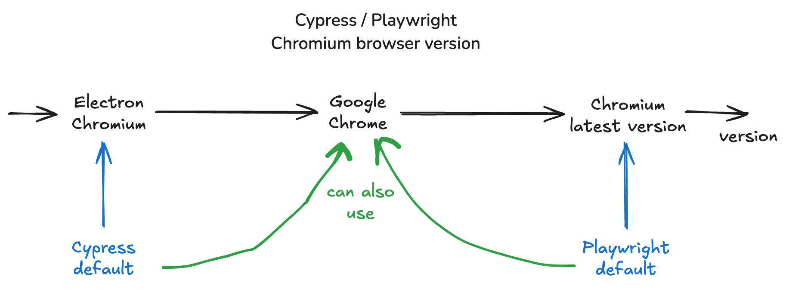

## ☀️ Installation and configuration

### 📚 You will learn

- Installing Playwright
- Installing Cypress
- Configuration and project options
- Documentation

---

## Quick check: Node.js version

```bash
$ node -v
v20.11.0
$ npm -v
10.2.4
```

If you need to install Node, see [Basics Requirements](https://github.com/bahmutov/cypress-workshop-basics#requirements) and 📹 [Install Node and Cypress](https://www.youtube.com/watch?v=09KbTRLrgWA)

---

## Quick check: versions

You can use [available-versions](https://github.com/bahmutov/available-versions) NPM package to quickly list the published package versions.

```
$ npx available-versions cypress
...
13.13.3                     a month
13.14.0                     a month
13.14.1                     25 days
13.14.2                     19 days    latest, dev

$ npx available-versions playwright
...
1.47.1                      10 days
1.47.2                      3 days     latest
```

+++

## Release frequency

- Cypress https://on.cypress.io/changelog
- Playwright https://github.com/microsoft/playwright/releases

---

## Todo: scaffold Playwright

In the folder with [bahmutov/cy-vs-pw-example-todomvc](https://github.com/bahmutov/cy-vs-pw-example-todomvc) repo

```
$ git checkout a1
$ npm install
$ npm init playwright@latest
```

Pick folder `pw` for E2E tests and use JavaScript for the specs.

+++

## Todo: inspect the created files

Playwright installation creates:

- `playwright.config.js`
- `pw/example.spec.js`
- `tests-examples/demo-todo-app.spec.js`

Let's look at each file 👀

🤔 Have any other files been modified?

+++

## Todo: use just the Chromium browser

- modify the `playwright.config.js` to run the tests on the single bundled Chromium browser

+++

## Todo: test the local app

- modify the `pw/example.spec.js`
  - have a single test that visits `localhost:3000` and confirms the page title
- look up test command by `npx playwright help` and `npx playwright <command> help`

**Note:** start the application in the separate terminal

+++

## Report vs Trace

- run the test and look at the test report
- run the test with a trace and look at the test report

---

## Tip: cleanup

Before going to the next step, here is how to clean up modified files:

```
# remove changes
$ git reset --hard
# remove new / untracked files
$ git clean -d -f
```

---

## Todo: install Cypress

Install Cypress in the project

- `git checkout a2`
- `npm install -D cypress`

+++

### How to open Cypress

```shell
npx cypress open
# or
yarn cypress open
# or
$(npm bin)/cypress open
# or
./node_modules/.bin/cypress open
```

+++

## Scaffold Cypress files

Open Cypress once using `npx cypress open`

Inspect the created files

+++

## Cypress files and folders

- "cypress.config.js" - all Cypress settings
- "cypress/e2e" - end-to-end test files (specs)
- "cypress/fixtures" - mock data <!-- .element: class="fragment" -->
- "cypress/support" - shared commands, utilities <!-- .element: class="fragment" -->

Read blog post [Cypress is just ...](https://glebbahmutov.com/blog/cypress-is/)

Note:
This section shows how Cypress scaffolds its files and folders. Then the students can ignore this folder. This is only done once to show the scaffolding.

---

## 💡 Pro tip

```shell
# quickly scaffolds Cypress folders
$ npx @bahmutov/cly init
# bare scaffold
$ npx @bahmutov/cly init -b
# typescript scaffold
$ npx @bahmutov/cly init --typescript
```

Repo [github.com/bahmutov/cly](https://github.com/bahmutov/cly)

---

## First Cypress spec

Modify the spec `cypress/e2e/spec.cy.js`

```js
// @ts-check
/// <reference types="cypress" />

it('has title', () => {
  // visit the page "localhost:3000"
  // https://on.cypress.io/visit
  // the page title should have text "cy-vs-pw-example-todomvc"
  // https://on.cypress.io/title
})
```

+++

## Run Cypress test

Cypress is really geared towards either working on the specs or running them headlessly

```
$ npx cypress open
$ npx cypress run
$ npx cypress help <command>
```

Run your spec headlessly.

🤔 How do you see what the test is doing?

+++

## Pick a browser



+++

## Enable videos

```js
const { defineConfig } = require('cypress')

module.exports = defineConfig({
  e2e: {
    video: true
  }
})
```

💡 Screenshots are taken automatically on failures

---

## IntelliSense

- look at the `///` comment. This tells your code editor about Cypress globals like `cy`
- the comment `// @ts-check` tells your code editor to show any type mismatches in the specs

---

## Docs and help

- Cypress documentation is at https://docs.cypress.io/
- Playwright documentation is at https://playwright.dev/docs/intro

When starting, read the introductions and the guides. Then consult the API docs as necessary.

+++

## Chat and support

- https://aka.ms/playwright/discord
- https://on.cypress.io/discord

+++

## 💡 Pro tip

```text
https://on.cypress.io/<command>
```

The above URL goes right to the documentation for that command.

---

## 🏁 Conclusions

- use the config file
- which browser?
- headed vs headless mode
- documentation is there

➡️ Pick the [next section](https://github.com/bahmutov/cypress-workshop-cy-vs-pw#contents) or jump to the [01-basic](?p=01-basic) chapter
