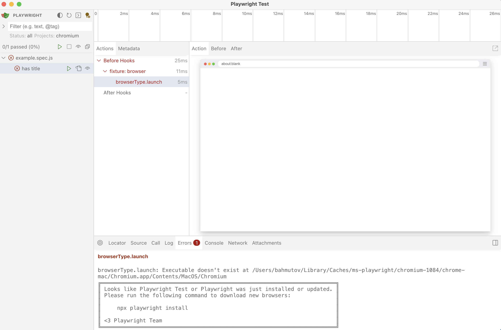
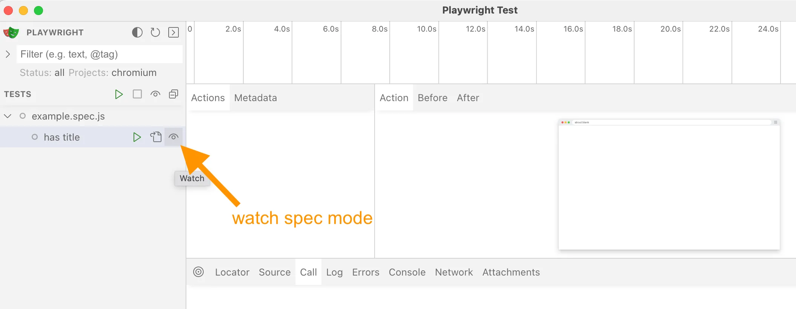
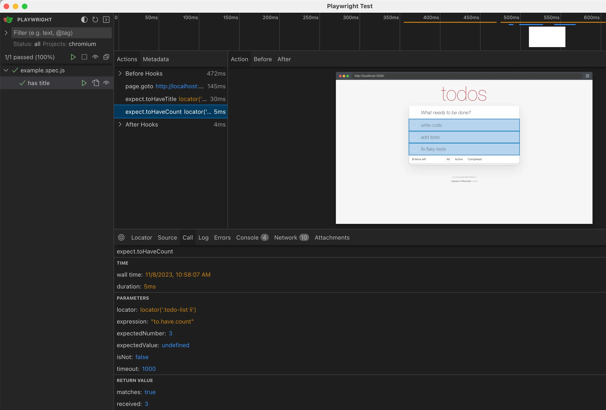

## The very basic tests

### 📚 You will learn

- start the application automatically
- interactive mode
- making HTTP requests
- the base URL

---

- clean up the existing code
  - `git reset --hard`
  - `git clean -d -f`
- `git checkout a4`
- `npm install`

+++

If necessary, run `npx playwright install` to install browsers



+++

### `package.json`

```json
{
  "scripts": {
    "start": "json-server ...",
    "reset": "node reset-db.js",
    "test:pw": "playwright test",
    "test:cy": "cypress run"
  },
  "dependencies": {
    "json-server": "0.17.4",
    "json-server-reset": "1.6.0"
  },
  "devDependencies": {
    "cypress": "^13.4.0",
    "@playwright/test": "^1.39.0"
  }
}
```

+++

## Todo: start the server from Playwright

- modify the `playwright.config.js` to start the server on port 3000
- verify the application starts when you run Pw tests

💡 Find docs for [Playwright Web Server](https://playwright.dev/docs/test-webserver)

+++

## Solution

```js
const { defineConfig, devices } = require('@playwright/test')

module.exports = defineConfig({
  ...,
  /* Run your local dev server before starting the tests */
  webServer: {
    command: 'npm run start',
    url: 'http://127.0.0.1:3000',
    reuseExistingServer: !process.env.CI,
    // if you want to see the output from the started web server
    // stdout: 'pipe',
  },
})
```

---

## Todo: start the server for Cypress

Use [bahmutov/start-server-and-test](https://github.com/bahmutov/start-server-and-test) plugin

+++

- `$ npm i -D start-server-and-test`

```json
{
  "scripts": {
    "start": "json-server ...",
    "test:pw": "playwright test",
    "test:cy": "cypress run",
    "e2e": "start-test start 3000 test:cy"
  }
}
```

and execute `npm run e2e`

---

## Interactive mode

While working locally, we want to re-run the tests when we save the spec file

- `cypress open` = `playwright test --ui`
- `cypress run` = `playwright test`

📚 [Playwright UI mode docs](https://playwright.dev/docs/test-ui-mode) and [cypress open](https://on.cypress.io/cypress-open)

---

## Working with Playwright test

- reset the code
- `git checkout a5`
- launch Pw interactive mode
- watch the spec file `example.spec.js`

+++

## Watching the spec file



+++

## Finish the test

```js
// pw/example.spec.js

const { test, expect } = require('@playwright/test')

test('has title', async ({ page }) => {
  await page.goto('http://localhost:3000/')

  // Expect a title "to contain" a substring.
  await expect(page).toHaveTitle('cy-vs-pw-example-todomvc')

  // confirm there are 3 todo items on the page
  // use the CSS selector ".todo-list li"
  // https://playwright.dev/docs/locators
  // and the count assertion
  // https://playwright.dev/docs/api/class-locatorassertions
})
```

💡 Read [Page locators](https://playwright.dev/docs/locators) and [Playwright assertions](https://playwright.dev/docs/api/class-locatorassertions)

+++



+++

## Pw Solution

```js
// confirm there are 3 todo items on the page
// use the CSS selector ".todo-list li"
// https://playwright.dev/docs/locators
// and the count assertion
// https://playwright.dev/docs/api/class-locatorassertions
await expect(page.locator('.todo-list li')).toHaveCount(3, {
  timeout: 1000
})
```

---

**Question:** what do you see at the end of the test in Playwright? In Cypress?

---

## Make HTTP request

- clean up the existing code
  - `git reset --hard`
  - `git clean -d -f`
- `git checkout a6`
- `npm install`

+++

Our app loads the data from `data.json` file. We want to clean up the data before each test. We can do it by making a HTTP call:

```
$ http :3000/reset todos:=[]
HTTP/1.1 200 OK
```

The file `data.json` should have an empty "todo" list.

+++

## App loads

```js
// app.js

SET_LOADING(state, flag) {
  state.loading = flag
  if (flag === false) {
    // an easy way for the application to signal
    // that it is done loading
    document.body.classList.add('loaded')
  }
}
```

+++

## Todo: Playwright spec

```js
// pw/example.spec.js

const { test, expect } = require('@playwright/test')

// before each test clear all todos
// by making a POST request to "/reset" endpoint
// and pass an object { todos: [] }
// which should clear all existing todos
// see:
// https://playwright.dev/docs/api/class-test
// https://playwright.dev/docs/api-testing

test('has title', async ({ page }) => {
  await page.goto('http://localhost:3000/')

  // confirm the page has finished loading todos
  // and the body element has CSS class "loaded"
  // https://playwright.dev/docs/api/class-locatorassertions
  //
  // confirm there are 0 todo items on the page
  // use the CSS selector ".todo-list li"
  // https://playwright.dev/docs/locators
  // and the count assertion
  // https://playwright.dev/docs/api/class-locatorassertions
})
```

💡 Read https://playwright.dev/docs/api-testing

+++

```js
// pw/example.spec.js

const { test, expect } = require('@playwright/test')

test.beforeEach(async ({ request }) => {
  await request.post('http://localhost:3000/reset', { data: { todos: [] } })
})

test('has title', async ({ page }) => {
  await page.goto('http://localhost:3000/')
  await expect(page.locator('body')).toHaveClass('loaded')
  // ^^^ alternative:
  await page.locator('body.loaded').waitFor()
  await expect(page.locator('.todo-list li')).toHaveCount(0)
})
```

One possible Playwright solution.

+++

## Tip: `waitFor` method

```js
await <locator>.waitFor({
  // defaults to 'visible'
  state: 'attached' | 'detached' | 'visible' | 'hidden',
  timeout: 0 // ms
})
```

Documentation https://playwright.dev/docs/api/class-locator#locator-wait-for

---

## Todo: Cypress spec

```js
// cypress/e2e/spec.cy.js

// before each test clear all todos
// by making a POST request to "/reset" endpoint
// and pass an object { todos: [] }
// which should clear all existing todos
// see:
// https://on.cypress.io/writing-and-organizing-tests#Hooks
// https://on.cypress.io/request

it('has title', () => {
  // visit the page "localhost:3000"
  // https://on.cypress.io/visit
  cy.visit('http://localhost:3000/')

  // confirm the page has finished loading todos
  // and the body element has CSS class "loaded"
  // https://on.cypress.io/get
  // https://on.cypress.io/assertions
  //
  // confirm there are 0 todo items on the page
  // use the CSS selector ".todo-list li"
  // https://on.cypress.io/get
  // https://on.cypress.io/assertions
})
```

+++

```js
beforeEach(() => {
  cy.request('POST', 'http://localhost:3000/reset', { todos: [] })
})

it('has title', () => {
  cy.visit('http://localhost:3000/')
  cy.get('body').should('have.class', 'loaded')
  // ^^^ alternative:
  cy.get('body.loaded')
  cy.get('.todo-list li').should('have.length', 0)
})
```

---

## Set the base URL

- clean up the existing code
  - `git reset --hard`
  - `git clean -d -f`
- `git checkout a7`
- `npm install`

+++

## Playwright base URL

Modify the `pw/example.spec.js` and `playwright.config.js` to remove the hard-coded `localhost:3000` from the spec

+++

```js
// playwright.config.js

const { defineConfig, devices } = require('@playwright/test')
module.exports = defineConfig({
  ...
  use: {
    /* Base URL to use in actions like `await page.goto('/')`. */
    baseURL: 'http://localhost:3000',
  },
})
```

---

## Cypress base URL

Modify the `cypress/e2e/spec.cy.js` and `cypress.config.js` to remove the hard-coded `localhost:3000` from the spec

+++

```js
// cypress.config.js

const { defineConfig } = require('cypress')

module.exports = defineConfig({
  e2e: {
    baseUrl: 'http://localhost:3000'
  }
})
```

---

## 🏁 Conclusions

- PW and CY have interactive mode
- you can make API requests to prepare the data before the test
- do not hard-code the base URL

➡️ Pick the [next section](https://github.com/bahmutov/cypress-workshop-cy-vs-pw#contents) or jump to the [02-adding-items](?p=02-adding-items) chapter
