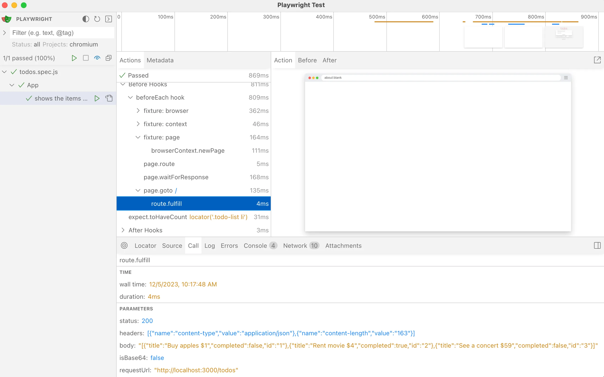
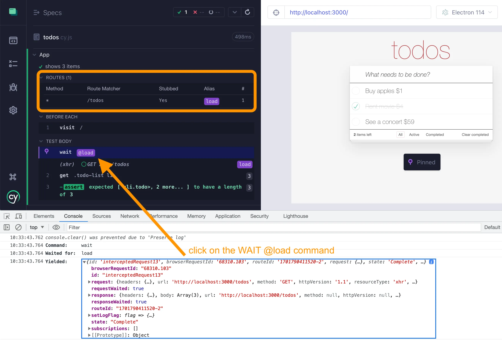

## Control network calls

### 📚 You will learn

- how to spy on / stub network calls
- how to wait for the network calls from tests
- how to use network calls in assertions

+++


+++

- clean up the existing code
  - `git reset --hard`
  - `git clean -d -f`
- `git checkout d1`
- `npm install`

---

## Important ⚠️

Always set up network spies / stubs **before** the action that makes the app make that network call.

---

## Playwright stub the network call

```js
// pw/todos.spec.js

const { test, expect } = require('@playwright/test')
const items = require('../fixtures/products.json')

test.describe('App', () => {
  test.beforeEach(async ({ page }) => {
    // set up a route handler for "/todos" endpoint
    // when the route matches, fulfill it using
    // the loaded items array
    // Tip: make sure to set the content type header
    //
    // set up a promise that waits for the response
    // to the network call "/todos"
    // https://playwright.dev/docs/network
    await page.goto('/')
  })

  test('shows the items with css class', async ({ page }) => {
    const todos = page.locator('.todo-list li')
    // wait for the intercepted network call "load"

    // confirm the the number of shown todos is 3
    // and that todos show up within 100ms of the load network call
    await expect(todos).toHaveCount(3)
  })
})
```

Stub the `GET /todos` network call in Playwright

+++

```js
// pw/todos.spec.js

const { test, expect } = require('@playwright/test')
const items = require('../fixtures/products.json')

test.describe('App', () => {
  let loadSpy

  test.beforeEach(async ({ page }) => {
    // set up a route handler for "/todos" endpoint
    // when the route matches, fulfill it using
    // the loaded items array
    // Tip: make sure to set the content type header
    await page.route('/todos', (route) =>
      route.fulfill({
        headers: { 'Content-Type': 'application/json' },
        body: JSON.stringify(items)
      })
    )
    // set up a promise that waits for the response
    // to the network call "/todos"
    // https://playwright.dev/docs/network
    loadSpy = page.waitForResponse('/todos')
    await page.goto('/')
  })

  test('shows the items with css class', async ({ page }) => {
    const todos = page.locator('.todo-list li')
    // wait for the intercepted network call "load"
    await loadSpy
    // confirm the the number of shown todos is 3
    // and that todos show up within 100ms of the load network call
    await expect(todos).toHaveCount(3, { timeout: 100 })
  })
})
```

+++



---

## Cypress network stub

```js
// cypress/e2e/todos.cy.js

describe('App', () => {
  beforeEach(() => {
    // stub the "GET /todos" network call the application makes
    // and return the data from the fixture file "products.json"
    // give this network stub an alias "load"
    // https://on.cypress.io/intercept
    // https://on.cypress.io/as
    cy.visit('/')
  })

  it('shows 3 items', () => {
    const todos = '.todo-list li'
    // wait for the intercepted network call "load"

    // confirm the the number of shown todos is 3
    // and that todos show up within 100ms of the load network call
    cy.get(todos).should('have.length', 3)
  })
})
```

+++

```js
// cypress/e2e/todos.cy.js

describe('App', () => {
  beforeEach(() => {
    // stub the "GET /todos" network call the application makes
    // and return the data from the fixture file "products.json"
    // give this network stub an alias "load"
    // https://on.cypress.io/intercept
    // https://on.cypress.io/as
    cy.intercept('/todos', { fixture: 'products.json' }).as('load')
    cy.visit('/')
  })

  it('shows 3 items', () => {
    const todos = '.todo-list li'
    // wait for the intercepted network call "load"
    cy.wait('@load')
    // confirm the the number of shown todos is 3
    // and that todos show up within 100ms of the load network call
    cy.get(todos, { timeout: 100 }).should('have.length', 3)
  })
})
```

+++



---

---

## 🏁 Spy and stub the network from your tests

- confirm the REST calls
- stub random data
- 🎓 [Cypress Network Testing Exercises](https://cypress.tips/courses/network-testing) course

➡️ Pick the [next section](https://github.com/bahmutov/cypress-workshop-basics#contents) or jump to the [06-app-data-store](?p=06-app-data-store) chapter
