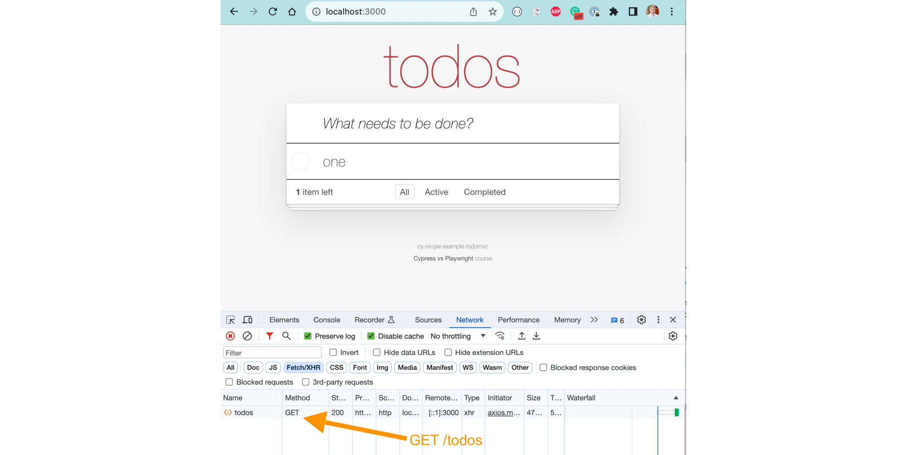
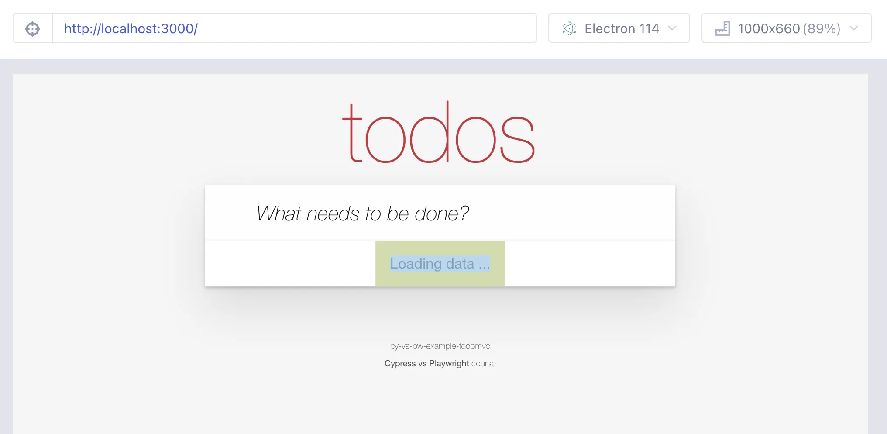

## Control network calls

### 📚 You will learn

- how to spy on / stub network calls
- how to wait for the network calls from tests
- how to use network calls in assertions
- how to delay a network call

+++



+++

- clean up the existing code
  - `git reset --hard`
  - `git clean -d -f`
- `git checkout d1`
- `npm install`

---

## Stub network calls

Let's mock the `GET /todos` network call and respond with the JSON fixture data.

+++

## Important ⚠️

Always set up network spies / stubs **before** the action that makes the app make that network call.

---

## Playwright stub the network call

```js
// pw/todos.spec.js

const { test, expect } = require('@playwright/test')
const items = require('../fixtures/products.json')

test.describe('App', () => {
  test.beforeEach(async ({ page }) => {
    // set up a route handler for "/todos" endpoint
    // when the route matches, fulfill it using
    // the loaded items array
    // Tip: make sure to set the content type header
    //
    // set up a promise that waits for the response
    // to the network call "/todos"
    // https://playwright.dev/docs/network
    await page.goto('/')
  })

  test('shows the items with css class', async ({ page }) => {
    const todos = page.locator('.todo-list li')
    // wait for the intercepted network call "load"

    // confirm the the number of shown todos is 3
    // and that todos show up within 100ms of the load network call
    await expect(todos).toHaveCount(3)
  })
})
```

Stub the `GET /todos` network call in Playwright

+++

```js
// pw/todos.spec.js

const { test, expect } = require('@playwright/test')
const items = require('../fixtures/products.json')

test.describe('App', () => {
  let loadSpy

  test.beforeEach(async ({ page }) => {
    // set up a route handler for "/todos" endpoint
    // when the route matches, fulfill it using
    // the loaded items array
    // Tip: make sure to set the content type header
    await page.route('/todos', (route) =>
      route.fulfill({
        headers: { 'Content-Type': 'application/json' },
        body: JSON.stringify(items)
      })
    )
    // set up a promise that waits for the response
    // to the network call "/todos"
    // https://playwright.dev/docs/network
    loadSpy = page.waitForResponse('/todos')
    await page.goto('/')
  })

  test('shows the items with css class', async ({ page }) => {
    const todos = page.locator('.todo-list li')
    // wait for the intercepted network call "load"
    await loadSpy
    // confirm the the number of shown todos is 3
    // and that todos show up within 100ms of the load network call
    await expect(todos).toHaveCount(3, { timeout: 100 })
  })
})
```

+++


---

## Cypress network stub

```js
// cypress/e2e/todos.cy.js

describe('App', () => {
  beforeEach(() => {
    // stub the "GET /todos" network call the application makes
    // and return the data from the fixture file "products.json"
    // give this network stub an alias "load"
    // https://on.cypress.io/intercept
    // https://on.cypress.io/as
    cy.visit('/')
  })

  it('shows 3 items', () => {
    const todos = '.todo-list li'
    // wait for the intercepted network call "load"

    // confirm the the number of shown todos is 3
    // and that todos show up within 100ms of the load network call
    cy.get(todos).should('have.length', 3)
  })
})
```

+++

```js
// cypress/e2e/todos.cy.js

describe('App', () => {
  beforeEach(() => {
    // stub the "GET /todos" network call the application makes
    // and return the data from the fixture file "products.json"
    // give this network stub an alias "load"
    // https://on.cypress.io/intercept
    // https://on.cypress.io/as
    cy.intercept('/todos', { fixture: 'products.json' }).as('load')
    cy.visit('/')
  })

  it('shows 3 items', () => {
    const todos = '.todo-list li'
    // wait for the intercepted network call "load"
    cy.wait('@load')
    // confirm the the number of shown todos is 3
    // and that todos show up within 100ms of the load network call
    cy.get(todos, { timeout: 100 }).should('have.length', 3)
  })
})
```

Cypress network stub solution

+++


---

## Spy on network call

Instead of stopping the network call, let it travel to the server. Use the response from the test.

- `get checkout d2`

+++

In the next lessons:

- **stub** the initial `GET /todos`
- **spy** on `POST /todos` calls

---

## Playwright network spy

```js
// pw/todos.spec.js
const { test, expect } = require('@playwright/test')

test.describe('App', () => {
  test.beforeEach(async ({ page }) => {
    // intercept the route "/todos"
    // - "GET /todos" respond with an empty list
    // - otherwise let the request continue
    await page.goto('/')
  })

  test('shows the items with css class', async ({ page }) => {
    // confirm the application has finished loading
    // by checking the presence of an element with class "loaded"
    // there should be no todos
    // spy on the "POST /todos" call
    // type new todo "Learn testing" followed by Enter
    // confirm the new todo was sent over the network
    // get the request data and confirm the known properties
    // like "title" and "completed"
    // the "id" property should be a string
  })
})
```

See https://playwright.dev/docs/network

+++

```js
// pw/todos.spec.js

const { test, expect } = require('@playwright/test')

test.describe('App', () => {
  test.beforeEach(async ({ page }) => {
    // intercept the route "/todos"
    // - "GET /todos" respond with an empty list
    // - otherwise let the request continue
    await page.route('/todos', (route) => {
      if (route.request().method() === 'GET') {
        return route.fulfill({
          headers: { 'Content-Type': 'application/json' },
          body: JSON.stringify([])
        })
      } else {
        return route.continue()
      }
    })
    await page.goto('/')
  })

  test('shows the items with css class', async ({ page }) => {
    // confirm the application has finished loading
    // by checking the presence of an element with class "loaded"
    await page.locator('.loaded').waitFor()
    // there should be no todos
    await expect(page.locator('.todo-list li')).toHaveCount(0)
    // spy on the "POST /todos" call
    const postTodo = page.waitForRequest((req) => {
      return req.method() === 'POST' && req.url().endsWith('/todos')
    })
    // type new todo "Learn testing" followed by Enter
    await page.locator('.new-todo').fill('Learn testing')
    await page.locator('.new-todo').press('Enter')
    // confirm the new todo was sent over the network
    const request = await postTodo
    // get the request data and confirm the known properties
    // like "title" and "completed"
    // the "id" property should be a string
    const sent = request.postDataJSON()
    expect(sent, 'request data').toEqual({
      title: 'Learn testing',
      completed: false,
      id: expect.any(String)
    })
    const response = await request.response()
    expect(response?.status(), 'status code').toEqual(201)
  })
})
```

---

## Cypress network spy

```js
// cypress/e2e/todos.cy.js

describe('App', () => {
  beforeEach(() => {
    // stub the "GET /todos" network calls
    // and return an empty array
    cy.visit('/')
  })

  it('sends new todo object', () => {
    const todos = '.todo-list li'
    // confirm the application has finished loading
    // by checking the presence of an element with class "loaded"
    // and there are no items

    // spy on the "POST /todos" call
    // give the spy an alias "post-todo"
    // https://on.cypress.io/intercept
    // https://on.cypress.io/as
    // type new todo "Learn testing" followed by Enter

    // confirm the new todo was sent over the network
    // get the request body and confirm the known properties
    // like "title" and "completed"
    // Tip: use the Chai assertion "deep.include"
    // https://glebbahmutov.com/cypress-examples/commands/assertions.html
    // confirm the request body includes the property "id"
    // which should be a string
    // get the network intercept with the new todo again
    // and confirm the server responds with status code 201
    // Tip: you wait for the network intercept to happen
    // and then can use cy.get('@alias') to retrieve it multiple times
  })
})
```

See https://on.cypress.io/network-requests

+++

```js
// cypress/e2e/todos.cy.js

describe('App', () => {
  beforeEach(() => {
    // stub the "GET /todos" network calls
    // and return an empty array
    cy.intercept('GET', '/todos', { body: [] })
    cy.visit('/')
  })

  it('sends new todo object', () => {
    const todos = '.todo-list li'
    // confirm the application has finished loading
    cy.get('.loaded')
    // and there are no items
    cy.get(todos).should('have.length', 0)
    // spy on the "POST /todos" call
    // give the spy an alias "post-todo"
    // https://on.cypress.io/intercept
    // https://on.cypress.io/as
    cy.intercept('POST', '/todos').as('post-todo')
    cy.get('.new-todo').type('Learn testing{enter}')
    // confirm the new todo was sent over the network
    cy.wait('@post-todo')
      // get the request body and confirm the known properties
      // like "title" and "completed"
      // Tip: use the Chai assertion "deep.include"
      // https://glebbahmutov.com/cypress-examples/commands/assertions.html
      .its('request.body')
      .should('deep.include', {
        title: 'Learn testing',
        completed: false
      })
      // confirm the request body includes the property "id"
      // which should be a string
      .its('id')
      .should('be.a', 'string')
    // get the network intercept with the new todo again
    // and confirm the server responds with status code 201
    // Tip: you wait for the network intercept to happen
    // and then can use cy.get('@alias') to retrieve it multiple times
    cy.get('@post-todo').its('response.statusCode').should('equal', 201)
  })
})
```

Cypress network spy solution

---

## Use network data

- `git checkout d3`

Let's spy on the network call and confirm the app shows the data correctly

---

## Playwright test

```js
// pw/todos.spec.js

const { test, expect } = require('@playwright/test')

test.describe('App', () => {
  test.beforeEach(async ({ page }) => {
    // spy on the network calls to "/todos" endpoint
    await page.goto('/')
  })

  test('shows the same number of items as sent by the server', async ({
    page
  }) => {
    // confirm the network call has happened
    // and get the response as json
    // confirm the page shows the same number of todo items
    // as send by the server
  })
})
```

+++

```js
// pw/todos.spec.js

const { test, expect } = require('@playwright/test')

test.describe('App', () => {
  let load

  test.beforeEach(async ({ page }) => {
    // spy on the network calls to "/todos" endpoint
    load = page.waitForRequest('/todos')
    await page.goto('/')
  })

  test('shows the same number of items as sent by the server', async ({
    page
  }) => {
    // confirm the network call has happened
    // and get the response as json
    const request = await load
    const response = await request.response()
    const todos = await response?.json()
    // confirm the page shows the same number of todo items
    // as send by the server
    await expect(page.locator('.todo-list li')).toHaveCount(todos.length)
  })
})
```

---

## Cypress test

```js
// cypress/e2e/todos.cy.js

describe('App', () => {
  beforeEach(() => {
    // spy on the network call "GET /todos"
    // give the network intercept an alias
    cy.visit('/')
  })

  it('shows the same number of items as sent by the server', () => {
    // wait for the network alias
    // get its response body and confirm
    // it is an array
    // grab its length and pass it to the cy.then callback
    // inside the callback get the number of Todo items
    // on the page, it should equal to the number of items
    // returned by the server
    // https://on.cypress.io/then
  })
})
```

+++

```js
// cypress/e2e/todos.cy.js

describe('App', () => {
  beforeEach(() => {
    // spy on the network call "GET /todos"
    // give the network intercept an alias
    cy.intercept('GET', '/todos').as('load')
    cy.visit('/')
  })

  it('shows the same number of items as sent by the server', () => {
    // wait for the network alias
    // get its response body and confirm
    // it is an array
    // grab its length and pass it to the cy.then callback
    // inside the callback get the number of Todo items
    // on the page, it should equal to the number of items
    // returned by the server
    // https://on.cypress.io/then
    cy.wait('@load')
      .its('response.body')
      .should('be.an', 'array')
      .its('length')
      .then((n) => {
        cy.get('.todo-list li').should('have.length', n)
      })
  })
})
```

**Tip:** in Cypress you always pass data that you get from the app using `cy.then(callback)`

---

## Data caching

**Important:** our application and browser cache network data using `ETag` and `If-None-Match` headers. Playwright disables caching automatically. In Cypress you have to control it yourself, see https://glebbahmutov.com/blog/cypress-intercept-problems/

+++

## Disable network caching in Cypress

```js
beforeEach(() => {
  // disable network caching using a Chrome Debugger Protocol command
  // by using "cy.wrap" command we ensure that the promise returned
  // by the Cypress.automation method resolves before proceeding
  // to the next Cypress command
  cy.wrap(
    Cypress.automation('remote:debugger:protocol', {
      command: 'Network.setCacheDisabled',
      params: {
        cacheDisabled: true
      }
    })
  )
  // spy on the network call "GET /todos"
  // give the network intercept an alias
  cy.intercept('GET', '/todos').as('load')
  cy.visit('/')
})
```

---

## Slow down network request

Let's spy on the `GET /todos` network request and slow it down to test the loading element.



+++

## Slow down network call in Playwright

- `git checkout d5`

```js
// pw/loader.spec.js

const { test } = require('@playwright/test')

test.describe('App', () => {
  test('shows a loader', async ({ page }) => {
    // intercept the "/todos" call
    // and delay it by 2 seconds before
    // allowing it to continue to the server

    // spy on the "/todos" network call
    // visit the page after setting up the network spies
    await page.goto('/')
    // confirm the loading element is visible
    // confirm the loading element is hidden
    // confirm the "/todos" call has happened
    // and the "class=loaded" element is visible quickly after
  })
})
```

**Tip:** read the https://playwright.dev/docs/api/class-route documentation.

+++

```js
// pw/loader.spec.js

const { test } = require('@playwright/test')

test.describe('App', () => {
  test('shows a loader', async ({ page }) => {
    // intercept the "/todos" call
    // and delay it by 2 seconds before
    // allowing it to continue to the server
    await page.route('/todos', (route) => {
      setTimeout(() => {
        route.continue()
      }, 2000)
    })
    // spy on the "/todos" network call
    const loading = page.waitForResponse('/todos')
    // visit the page after setting up the network spies
    await page.goto('/')
    // confirm the loading element is visible
    await page.locator('.loading').waitFor({ state: 'visible' })
    // confirm the loading element is hidden
    await page.locator('.loading').waitFor({ state: 'hidden' })
    // confirm the "/todos" call has happened
    await loading
    // and the "class=loaded" element is visible quickly after
    await page.locator('.loaded').waitFor({ timeout: 100 })
  })
})
```

Playwright solution

---

## Delay network call in Cypress

```js
// cypress/e2e/loader.cy.js

describe('App', () => {
  it('shows a loader', () => {
    // intercept the "GET /todos" network call
    // let the call continue to the server
    // but delay it by 2 seconds
    // This should give the loading element plenty of time
    cy.visit('/')
    // confirm the loading element is visible
    // and then becomes hidden

    // confirm the app finishes loading really quickly
    // after the loader becomes hidden
  })
})
```

**Hint:** read https://on.cypress.io/intercept documentation

+++

```js
// cypress/e2e/loader.cy.js

describe('App', () => {
  it('shows a loader', () => {
    // intercept the "GET /todos" network call
    // let the call continue to the server
    // but delay it by 2 seconds
    // This should give the loading element plenty of time
    cy.intercept('GET', '/todos', () => Cypress.Promise.delay(2000))
    cy.visit('/')
    // confirm the loading element is visible
    // and then becomes hidden
    cy.get('.loading').should('be.visible')
    cy.get('.loading').should('not.be.visible')
    // confirm the app finishes loading really quickly
    // after the loader becomes hidden
    cy.get('.loaded', { timeout: 100 })
  })
})
```

Cypress network request delay example

---

## 🏁 Spy and stub the network from your tests

- stub network calls to control the data
- spy on network calls during tests
- network caching might affect the testing
- 🎓 [Cypress Network Testing Exercises](https://cypress.tips/courses/network-testing) course

➡️ Pick the [next section](https://github.com/bahmutov/cypress-workshop-basics#contents) or jump to the [07-clock](?p=07-clock) chapter
