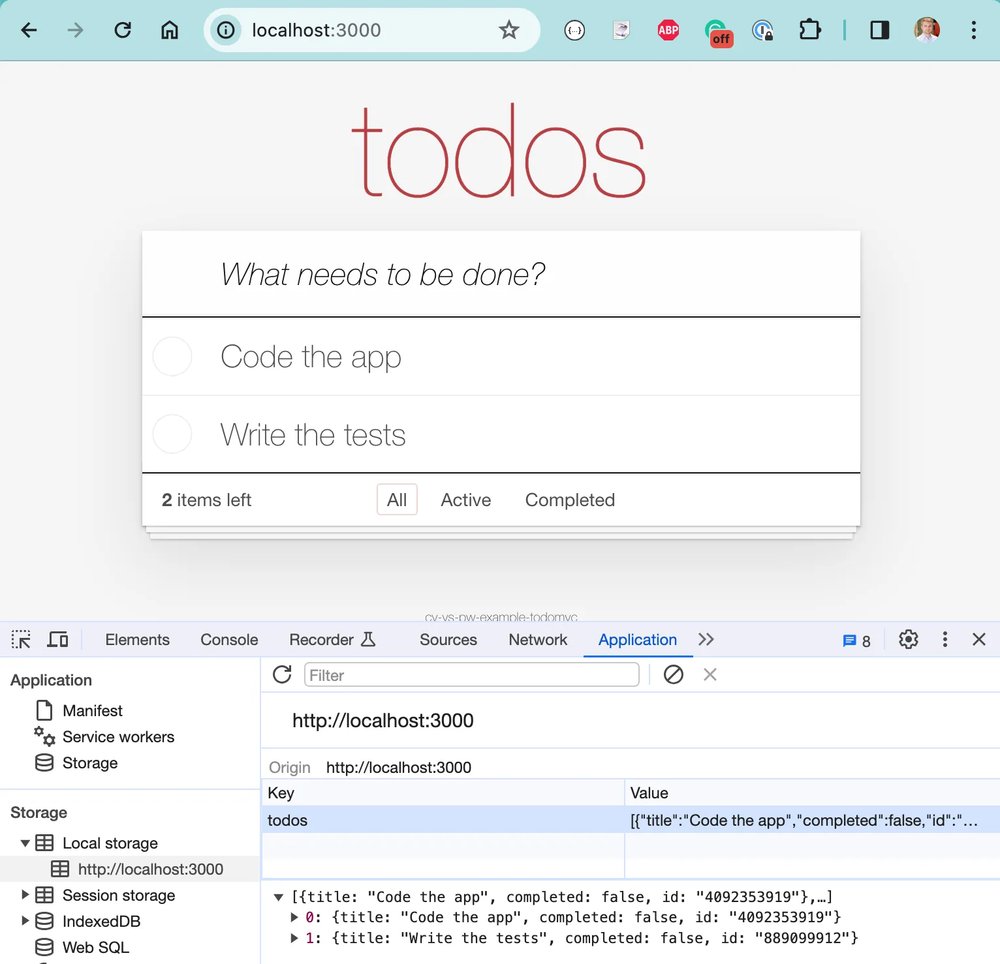
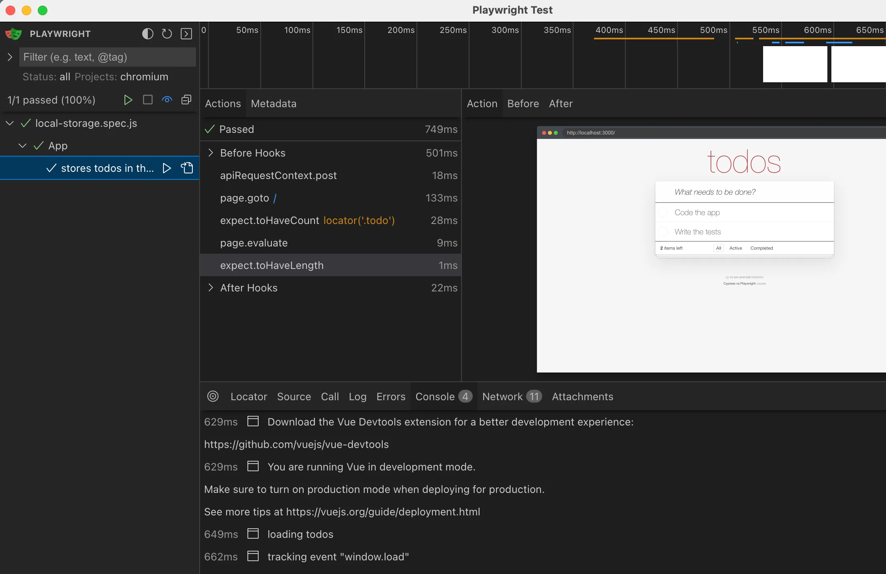
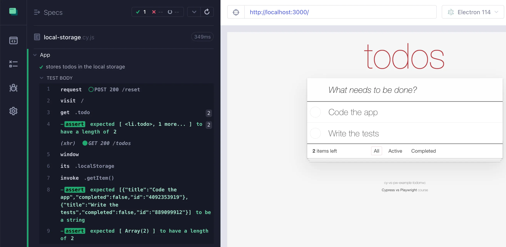

## App Access

### 📚 You will learn

- how to access the application data stored in `localStorage`

```js
// app.js
SET_TODOS(state, todos) {
  // save the todos to the local storage
  localStorage.setItem('todos', JSON.stringify(todos))
},
```

+++



+++

## Check out the branch

- `git checkout e4`
- check the `localStorage` in the browser

---

## Playwright

```js
// pw/local-storage.spec.js
const { test, expect } = require('@playwright/test')

// load the two todos from the "./fixtures/two-items.json" file
const todos = require('../fixtures/two-items.json')

test.describe('App', () => {
  test('stores todos in the local storage', async ({ page, request }) => {
    // reset the backend to only have those todo items
    // by making a network request to the "/reset" endpoint

    // visit the home page
    await page.goto('/')
    // there should be two items on the page

    // the local storage should have two items
    // under the property "todos"
    // get the local storage item "todos" and parse it
    // and return back to the test
    // Tip: use page.evaluate to run code in the browser
  })
})
```

**Remember:** Playwright script executes in Node.js environment and sends the commands to the browser.

+++

```js
await expect(page.locator('.todo')).toHaveCount(2)
// the local storage should have two items
// under the property "todos"
// get the local storage item "todos" and parse it
// and return back to the test
// Tip: use page.evaluate to run code in the browser
const items = await page.evaluate(() => {
  return JSON.parse(localStorage.getItem('todos'))
})
expect(items).toHaveLength(2)
```

+++



---

## Cypress

```js
// cypress/e2e/local-storage.cy.js

describe('App', () => {
  it('stores todos in the local storage', () => {
    // load todos from the fixture file "two-items.json"
    // and reset the backend to only have those todo items

    cy.visit('/')
    // there should be two items on the page

    // the local storage should have two items
    // Tip: the local storage is available under "window.localStorage"
    // and to get an item from the local storage you
    // can invoke the "getItem" method on it
    // confirm the item is a string
    // then parse it into an object
    // which should be an array with 2 items
  })
})
```

**Hint:** Cypress tests run in the browser and can directly access the app's `window` via https://on.cypress.io/window command

+++

```js
// there should be two items on the page
cy.get('.todo').should('have.length', 2)
// the local storage should have two items
// Tip: the local storage is available under "window.localStorage"
// and to get an item from the local storage you
// can invoke the "getItem" method on it
cy.window()
  .its('localStorage')
  .invoke('getItem', 'todos')
  // confirm the item is a string
  // then parse it into an object
  .should('be.a', 'string')
  .then(JSON.parse)
  // which should be an array with 2 items
  .should('have.length', 2)
```

+++



---

## 🏁 Access the application data

- Playwright can evaluate JavaScript to return a copy of the app's data from the browser
- Cypress can directly access the application's data and code

➡️ Go to the [end](?p=end) chapter
