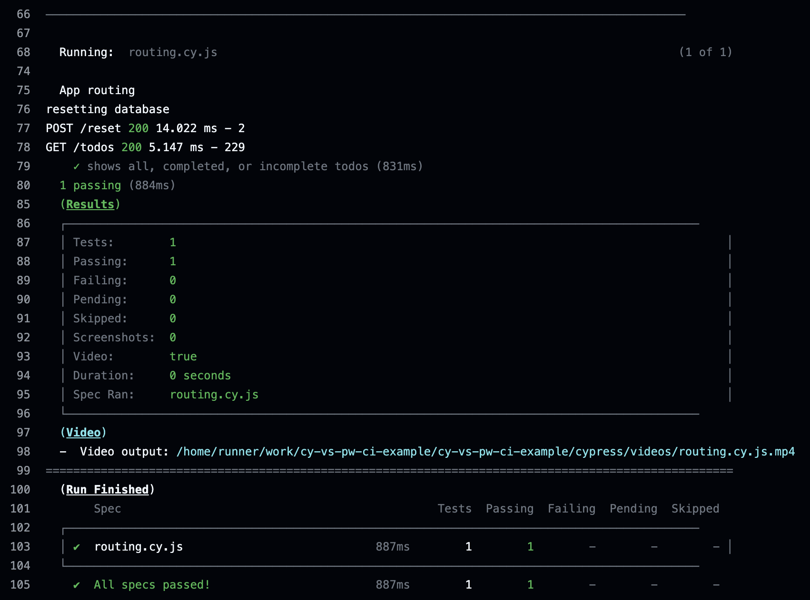

## Run Tests On CI

### 📚 You will learn

- running Cypress E2E tests on CI
- running Playwright E2E tests on CI

+++

## Cypress

**Q:** How would you run Cypress E2E tests on GitHub Actions?

- 💡 use [cypress-io/github-action](https://github.com/cypress-io/github-action)

+++

```yml
name: cypress tests
on: push
jobs:
  e2e:
    runs-on: ubuntu-22.04
    steps:
      - name: get the code
        uses: actions/checkout@v4
      - name: run tests
        uses: cypress-io/github-action@v6
        with:
          start: npm start
```

`.github/workflows/ci.yml`

+++



+++

```yml
- name: run tests
  uses: cypress-io/github-action@v6
  with:
    start: npm start
```

The above YML does it all: installs dependencies, caches them, starts the app, runs the tests, etc.

+++

## Control the environment

**Q:** How to run the tests on the same OS / browser?

- 💡 Use Cypress official Docker image https://hub.docker.com/r/cypress/browsers/tags

+++

```yml
runs-on: ubuntu-22.04
# Cypress Docker image from https://hub.docker.com/r/cypress
# with browsers pre-installed
container:
  image: cypress/browsers:node-20.17.0-chrome-129.0.6668.70-1-ff-130.0.1-edge-129.0.2792.52-1
steps:
  - uses: actions/checkout@v4
  - uses: cypress-io/github-action@v6
    with:
      browser: chrome
```

---

## 🏁 Access the application data

- Playwright can evaluate JavaScript to return a copy of the app's data from the browser
- Cypress can directly access the application's data and code

➡️ Go to the [end](?p=end) chapter
