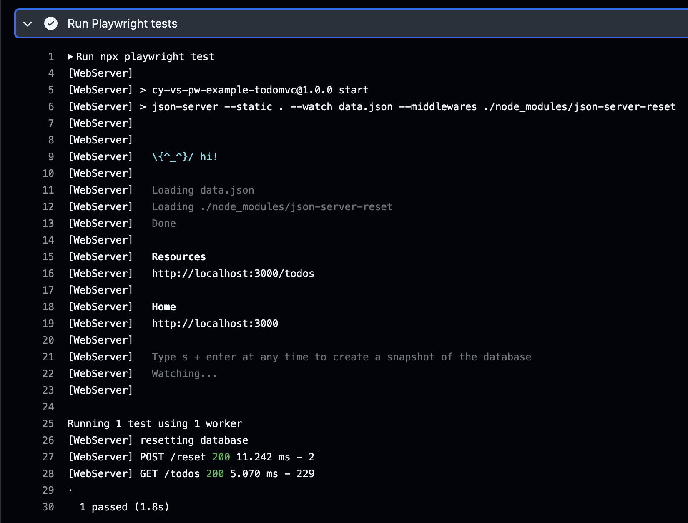
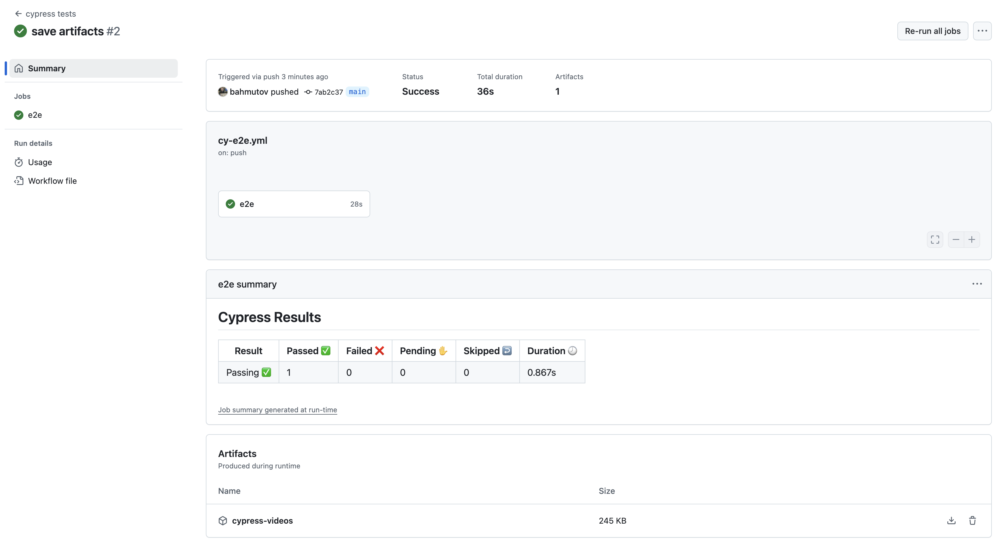
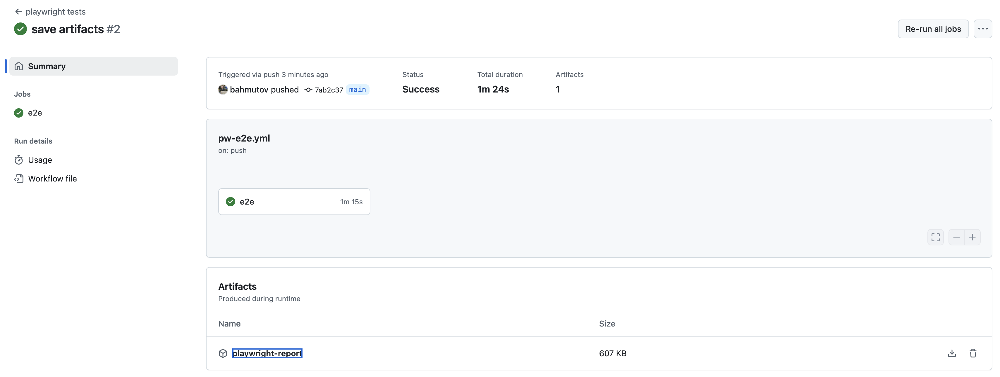
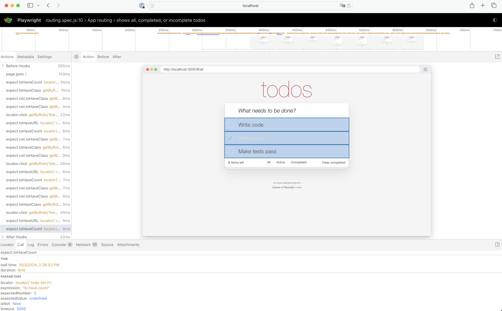

## Run Tests On CI

### 🎓 You will learn

- running Cypress E2E tests on CI
  - 📚 https://on.cypress.io/ci
- running Playwright E2E tests on CI <!-- .element: class="fragment" -->
  - 📚 https://playwright.dev/docs/ci

---

## Cypress

**Q:** How would you run Cypress E2E tests on GitHub Actions?

- 💡 use [cypress-io/github-action](https://github.com/cypress-io/github-action)
- Example repo https://github.com/bahmutov/cy-vs-pw-ci-example

+++

```yml
name: cypress tests
on: push
jobs:
  e2e:
    runs-on: ubuntu-22.04
    steps:
      - name: get the code
        uses: actions/checkout@v4
      - name: run tests
        uses: cypress-io/github-action@v6
        with:
          start: npm start
```

`.github/workflows/ci.yml`

+++


+++

```yml
- name: run tests
  uses: cypress-io/github-action@v6
  with:
    start: npm start
```

The above YML does it all: installs dependencies, caches them, starts the app, runs the tests, etc.

+++

## Playwright

**Q:** How would you run Pw E2E tests on GitHub Actions?

- 💡 check https://playwright.dev/docs/ci

+++

```yml
name: playwright tests
on: push
jobs:
  e2e:
    runs-on: ubuntu-22.04
    steps:
      - name: get the code
        uses: actions/checkout@v4
      - uses: actions/setup-node@v4
        with:
          node-version: 20
      - name: Install dependencies
        run: npm ci
      - name: Install Playwright Browsers
        run: npx playwright install --with-deps
      - name: Run Playwright tests
        run: npx playwright test
```

+++



---

## Control the environment

**Q:** How to run the tests on the same OS / browser?

- 💡 Use Cypress official Docker image https://hub.docker.com/r/cypress/browsers/tags
- 💡 Use MS official Docker image https://playwright.dev/docs/docker

+++

## Cypress Docker example

```yml
runs-on: ubuntu-22.04
# Cypress Docker image from https://hub.docker.com/r/cypress
# with browsers pre-installed
container:
  image: cypress/browsers:node-20.17.0-chrome-129.0.6668.70-1-ff-130.0.1-edge-129.0.2792.52-1
steps:
  - uses: actions/checkout@v4
  - uses: cypress-io/github-action@v6
    with:
      browser: chrome
```

+++

## Playwright Docker example

```yml
jobs:
  playwright:
    name: 'Playwright Tests'
    runs-on: ubuntu-22.04
    container:
      image: mcr.microsoft.com/playwright:v1.47.2-jammy
```

---

## Store test artifacts

Screenshots (Cy), videos (Cy), test traces (Pw)

+++

## Store Cypress screenshots and videos on CI

```yml
- uses: cypress-io/github-action@v6
# after the test run completes store videos and any screenshots
- uses: actions/upload-artifact@v4
  with:
    name: cypress-screenshots
    path: cypress/screenshots
    if-no-files-found: ignore
- uses: actions/upload-artifact@v4
  with:
    name: cypress-videos
    path: cypress/videos
    if-no-files-found: ignore
```

+++



+++

## Store Playwright test reports and traces

```yml
- name: Run Playwright tests
  run: npx playwright test
- uses: actions/upload-artifact@v4
  if: ${{ !cancelled() }}
  with:
    name: playwright-report
    path: playwright-report/
    retention-days: 30
```

+++

**Tip:** Enable traces on all CI runs

```js
// playwright.config.js
/* Collect trace when retrying the failed test. See https://playwright.dev/docs/trace-viewer */
trace: Boolean(process.env.CI) ? 'on' : 'on-first-retry',
```

+++



+++

## View Playwright trace

- download and unzip
- `npx playwright show-report <path to the unzipped folder>`

+++



---

## Parallel CI

- a way to get N times speedup
- Cypress: use Cypress Cloud or https://github.com/bahmutov/cypress-split
- Playwright: sharding across machines https://playwright.dev/docs/test-parallel#shard-tests-between-multiple-machines

---

## 🏁 CI

- use Docker image to tightly control the container
- use Cypress official GitHub Action <!-- .element: class="fragment" -->
- store test artifacts (both successes and failures) <!-- .element: class="fragment" -->
- run tests in parallel 🏎️ <!-- .element: class="fragment" -->

➡️ Go to the [end](?p=end) chapter
