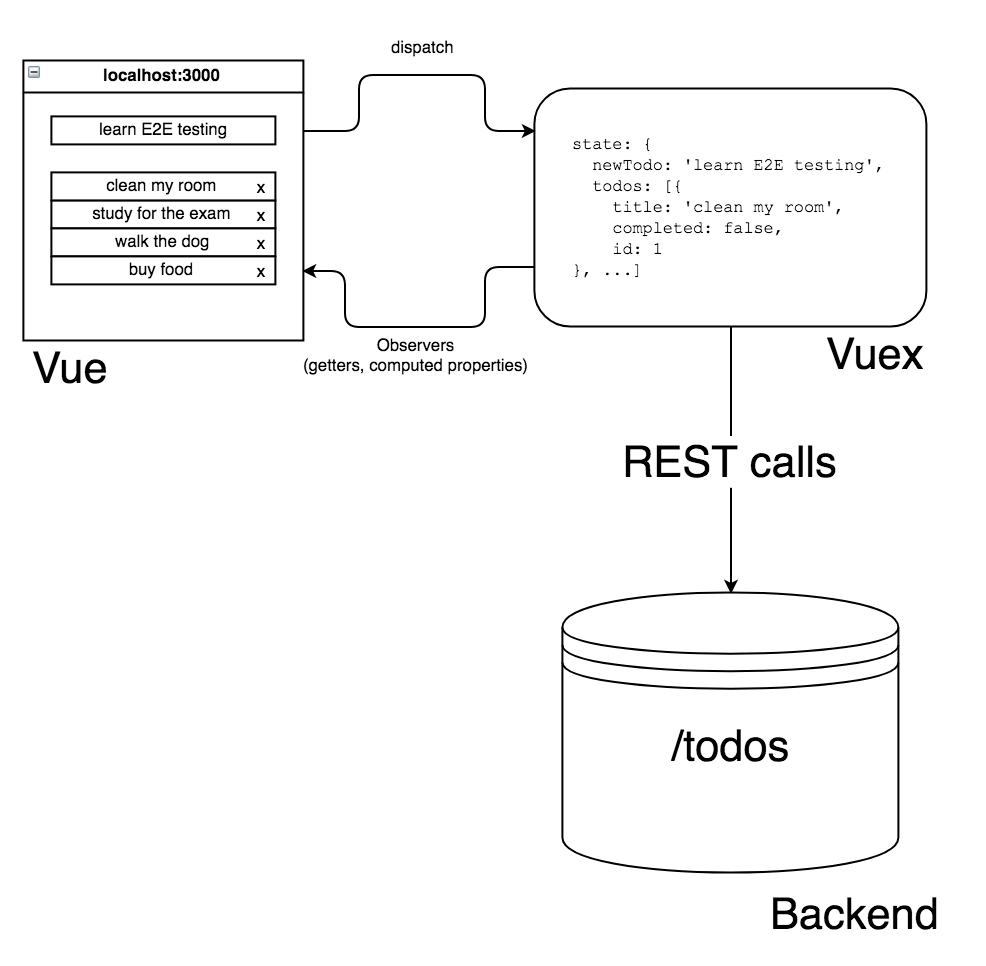

# Cypress Vs Playwright

## Workshop

- [github.com/bahmutov/cypress-workshop-cy-vs-pw](https://github.com/bahmutov/cypress-workshop-cy-vs-pw)

Jump to: [00-start](?p=00-start), [01-basic](?p=01-basic), [02-adding-items](?p=02-adding-items), [03-completing-items](?p=03-completing-items), [04-test-ui](?p=04-test-ui), [05-hover](?p=05-hover), [06-network](?p=06-network), [end](?p=end)

+++

## Author: Gleb Bahmutov, PhD

- Ex-VP of Engineering at Cypress
- Ex-Distinguished Engineer at Cypress
- actively using Cypress since 2016
- [gleb.dev](https://gleb.dev)
- [@bahmutov](https://twitter.com/bahmutov)
- [https://glebbahmutov.com/blog/tags/cypress/](https://glebbahmutov.com/blog/tags/cypress/) 300+ Cypress blog posts
- [https://www.youtube.com/glebbahmutov](https://www.youtube.com/glebbahmutov) 700+ Cypress videos
- [cypress.tips](https://cypress.tips) with links, search, my courses
- [Cypress Tips](https://cypresstips.substack.com/) monthly newsletter

+++

[cypress.tips/courses](https://cypress.tips/courses)


+++

## Can Gleb be fair?

I will try.

---

## What we are going to cover

- example TodoMVC
  - web app, data store, REST calls
- basic tests using Pw and Cy
- using JSON fixture files
- making HTTP requests
- network spying and stubbing, fixtures
- controlling the application clock
- assertions and retries
- any questions

---

## Schedule 🕰

- 55 minutes of work
- 5 minutes of rest
- time for questions during the workshop and after each section

+++

## Poll 1 🗳️: have you used Cypress before?

- This is my first time
- Using for less than 1 month 👍<!-- .element: class="fragment" -->
- Using it for less than 1 year 👍👍<!-- .element: class="fragment" -->
- Using for longer than 1 year ❤️<!-- .element: class="fragment" -->
- Using for longer than 2 years ❤️❤️<!-- .element: class="fragment" -->

---

## Poll 2 🗳️: have you used Playwright before?

- This is my first time
- Using for less than 1 month 👍<!-- .element: class="fragment" -->
- Using it for less than 1 year 👍👍<!-- .element: class="fragment" -->
- Using for longer than 1 year ❤️<!-- .element: class="fragment" -->
- Using for longer than 2 years ❤️❤️<!-- .element: class="fragment" -->

---

## Example application

We will use [bahmutov/cy-vs-pw-example-todomvc](https://github.com/bahmutov/cy-vs-pw-example-todomvc)

- each exercise starts in the prepared branch
- `git checkout a1` for example
- `npm install`

---

## How efficient learning works

1. I explain and show
2. We do together
3. You do and I help

**Tip:** this repository has everything to work through the test exercises.

[bahmutov/cy-vs-pw-example-todomvc](https://github.com/bahmutov/cy-vs-pw-example-todomvc)

+++

🎓 This workshop covers a subset of lessons from my course [Cypress vs Playwright](https://cypress.tips/courses/cypress-vs-playwright)

The repo has the starting code in multiple branches.

---

## Requirements

You will need:

- `git` to clone the example repo
- Node v20+ to install dependencies

```text
git clone git@github.com:bahmutov/cy-vs-pw-example-todomvc.git
cd cy-vs-pw-example-todomvc
git checkout <branch name>
npm install
```

---

## The app `todomvc`

Let us look at the application.

- `cd cy-vs-pw-example-todomvc`
- `git checkout main`
- `npm start`
- `open localhost:3000`

+++

It is a regular TodoMVC application.


+++

If you have Vue DevTools plugin


+++

Look at XHR when using the app


+++

Look at `todomvc/index.html` - main app DOM structure


+++

Look at `todomvc/app.js`


+++

## Questions

- what happens when you add a new Todo item? <!-- .element: class="fragment" -->
- how does it get to the server? <!-- .element: class="fragment" -->
- where does the server save it? <!-- .element: class="fragment" -->
- what happens on start up? <!-- .element: class="fragment" -->

Note:
The students should open DevTools and look at XHR requests that go between the web application and the server. Also the students should find `todomvc/data.json` file with saved items.

---



Note:
This app has been coded and described in this blog post [https://www.cypress.io/blog/2017/11/28/testing-vue-web-application-with-vuex-data-store-and-rest-backend/](https://www.cypress.io/blog/2017/11/28/testing-vue-web-application-with-vuex-data-store-and-rest-backend/)

+++

This app has been coded and described in this blog post [https://www.cypress.io/blog/2017/11/28/testing-vue-web-application-with-vuex-data-store-and-rest-backend/](https://www.cypress.io/blog/2017/11/28/testing-vue-web-application-with-vuex-data-store-and-rest-backend/)

---

## End of introduction

➡️ Pick the [next section](https://github.com/bahmutov/cypress-workshop-cy-vs-pw#contents) or go to the [00-start](?p=00-start) chapter
